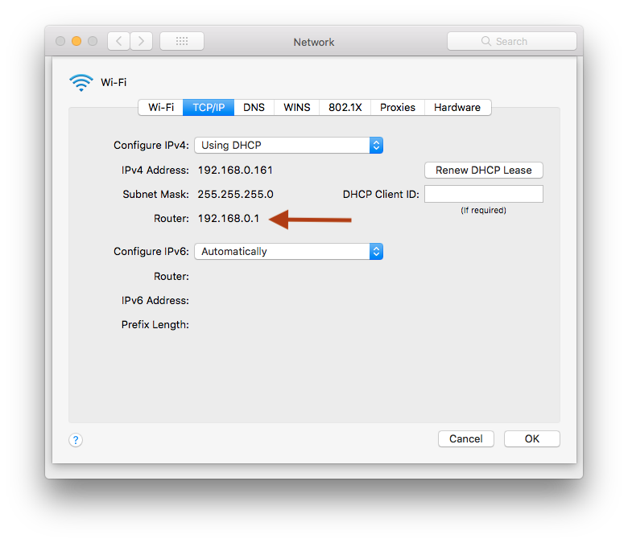

## Problem:  

Can't connect to hotel [Wi-Fi](https://en.wikipedia.org/wiki/Wi-Fi).

I got the normal pop up window for their [captive portal](https://en.wikipedia.org/wiki/Captive_portal) that shows as soon as I connected my Mac laptop to the hotel wifi. This was on a antique Apple MacBook Pro laptop running macOS high sierra 10.13.x.

Also, Wi-Fi was working just fine on my iPhone and my Wives laptop running Windows 11, so their system was not broken for everyone else.

No matter what, the captive portal that was presented when connecting to the hotel Wi-Fi was not going away on my Mac. Almost like the submit button was not fully working. Tried the access code, and even tried the other option of last name and room number. Nothing was working after clicking submit. Hotel front desk was no help. Thing just hung on entry and every few second would blink the contents of the page, the captive portal would never go away and the internet would never connect. 

## Solution

Connect to the router / captive portal  directly in a current browser and by pass the automatic portal.

What eventually worked was doing the following:

1. Clicked cancel to close the not working captive portal window.

2. Opened System Preferences 

3. Clicked on Network

4. Clicked on Advanced

5. Clicked the TCP/IP Tab 

6. Found  what the router IP was on the IHG Connected Wifi, copied that down.
    

7. Opened [ungoogled Chromium](https://ungoogled-software.github.io/), pasted in the IP, hit enter.

8. The IHG Portal page loaded in the browser window, and it finally took the access code. 

9. Tried loading another web site and internet was finally working...