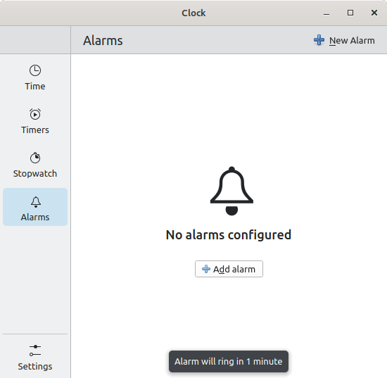

If your in a situation where you are using KDE Clock and are unable to get Alarms
add to the list of Alarms . Here is a fix I have found that works.

## The issue.

You attempt to add an  Alarm to the Clock program under the Alarms section. You fill in the details and click Done and no Alarms are listed. You may see a brief pop up towards the bottom of the window saying Alarm will ring in x minutes, but will notice there are now no Alarms listed. When this happens the Alarm will not  work.

## A Solution that has worked for me.

1. The fix is to close the Clock window.

2. Open System Monitor

3. Click the Processes Tab

4. Type in "kclockd" and

5. Select the kclockd process by left clicking it or the equivalent of a standard click.

6. Cick the End Process button at the bottom of the screen.

7. Re Open the Clock program

8. Attempt to add a new alarm for a few minutes into the future.

9. Alarm should add and show in the list it may show duplicate, but that is normal bug with this program.

10. Otherwise something else is broken trying updating the program, restarting the computer, etc.