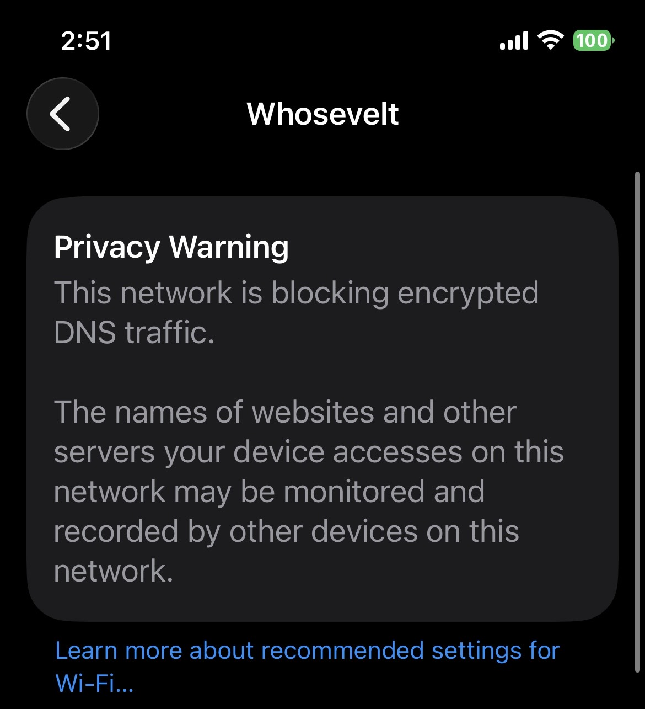

Figure out what the meaning and cause of  this iPhone Privacy Warning.


>Privacy Warning

>The network is blocking encrypted DNS Traffic

>The names of websites and other servers your device accesses on this network may be monitored and recorded by other devices on this network. 




Here’s the plain‑English version of what your iPhone is telling you — and why it happens specifically on **OpenWrt** networks.

---

# 📡 What the iPhone Message Means
**“Privacy Warning – The network is blocking encrypted DNS traffic.”**

Your iPhone is saying:

- It tried to use **Encrypted DNS** (like DNS-over-HTTPS or DNS-over-TLS).
- Your network (OpenWrt) **intercepted, blocked, or redirected** that encrypted DNS traffic.
- Because of that, the iPhone had to fall back to **unencrypted DNS**, which *can* be monitored by anyone on the same network.

This is not an accusation that someone *is* spying — just that the network *could*.

---

# 🔍 Why This Happens on OpenWrt
OpenWrt often triggers this warning because of one or more of these:

### **1. DNS Hijacking / Rebinding Protection**
OpenWrt by default forces all DNS requests to go through its own resolver (dnsmasq or odhcpd).  
This means:

- Even if the iPhone tries to use encrypted DNS → OpenWrt intercepts it
- iPhone sees this as “blocking encrypted DNS”

### **2. Adblock / DNS Filtering**
If you run:

- Adblock
- AdGuard Home
- Unbound
- Stubby
- DNS redirect rules

…these often break or override Apple’s encrypted DNS.

### **3. Firewall Redirect Rules**
Many OpenWrt setups include:

```
redirect port 53 → router
```

This forces all DNS through the router, which iOS interprets as “encrypted DNS blocked.”

---

# 🛠️ How to Fix (or Silence) the Warning
You have a few options depending on what you want.

---

## ✅ **Option 1: Allow Encrypted DNS (Recommended if you want Apple’s privacy features)**
You must remove or modify DNS hijacking rules.

Look for firewall rules like:

```
config redirect
    option src 'lan'
    option src_dport '53'
    option dest_port '53'
    option proto 'tcp udp'
    option target 'DNAT'
```

Disable or delete them.

Then ensure your DHCP advertises a DNS server that supports encrypted DNS (like Cloudflare or NextDNS).

---

## ✅ **Option 2: Use OpenWrt’s DNS Encryption Instead (and ignore the warning)**
If you run:

- Unbound
- DNS-over-TLS
- DNS-over-HTTPS
- AdGuard Home

…your DNS *is* encrypted — just not in the way Apple expects.

The iPhone will still warn you, but your privacy is fine.

---

## ✅ **Option 3: Disable Private DNS on iPhone for this network**
On the iPhone:

**Settings → Wi‑Fi → (your network) → Private Wi‑Fi Address / Limit IP Tracking / Private DNS**

Turn off “Limit IP Tracking” for this network.

This silences the warning but does not change your DNS behavior.

---

# 🧠 Bottom Line
Your iPhone is warning you because **OpenWrt is forcing DNS through the router**, which prevents the iPhone from using Apple’s encrypted DNS.

It does **not** mean:

- Your network is unsafe
- Someone is spying
- Your router is compromised

It simply means **OpenWrt is in control of DNS**, not the iPhone.

---
