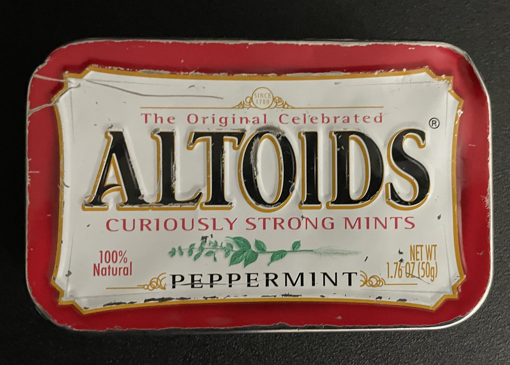
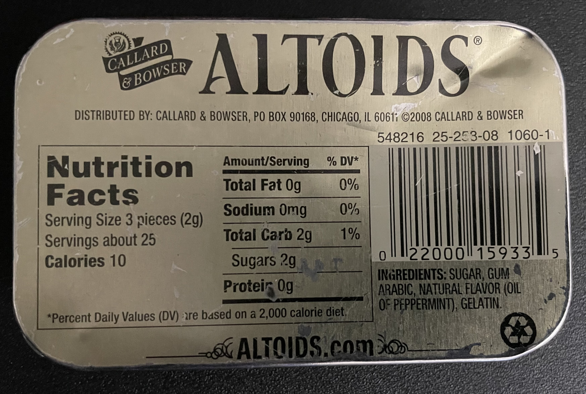
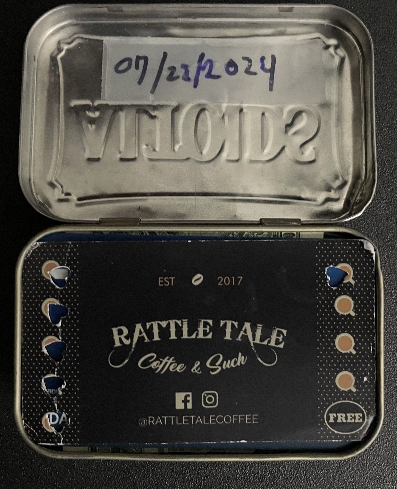

# Introduction
While I was at the Apple Store in boise town center getting a new battery installed.  I saw something truly innovative by another customer also in for a genius bar appointment.

The gentleman had an old well-worn Altoids tin that he had pulled from a pocket to pay for service at the Apple Store. I noticed and asked about it.  He said he had been using the tin for over 10 years. I never had a traditional leather wallet last 10 years. And I was needing a new wallet, and had a tin in my backpack still with mints in it. So I gave it a try moving to this new wallet on July 22, 2024.

# Altoids Tin makes a pretty good Wallet

The tin is just the right size for a wallet. It is a bit larger than a credit card, so it can hold quite a few cards and some cash. I have been using it for a few months now, and it is working out well. I have my ID, credit cards, and a few other cards in it. I have also been able to keep some cash in it as well.

# Managing the wallet

I use bubble to the top management technique for my wallet. I have a few cards that I use all the time, and I keep them at the top of the stack. I have a few cards that I use less often, and I keep them in the middle of the stack. I have a few cards that I use rarely, and I keep them at the bottom of the stack. I have a few cards that I use only in emergencies, and I keep them in the back of the stack. This is the best way to manage the wallet since getting the card out can be a bit of a hassle. Cards are held in really well no fear of cards just all falling out. There may be some room for improvement in this area maybe a cloth pull cord like found in electronic device that knocked out the batteries, but instead would lift the cards for easier access.

The wallet is incredible tough, as you can see lots of dings and dents, and It's still going strong. If was even slammed pretty good on concrete, and It's still going. And if you bang it up too much its east to bend back into shape with pliers.

# Conclusion

If you're willing to give this a try it's an excellent way to run a wallet, very adorable and durable. And about the same thickness as a classic leather wallet. I would have to say this is the best wallet I have ever had so far. 

