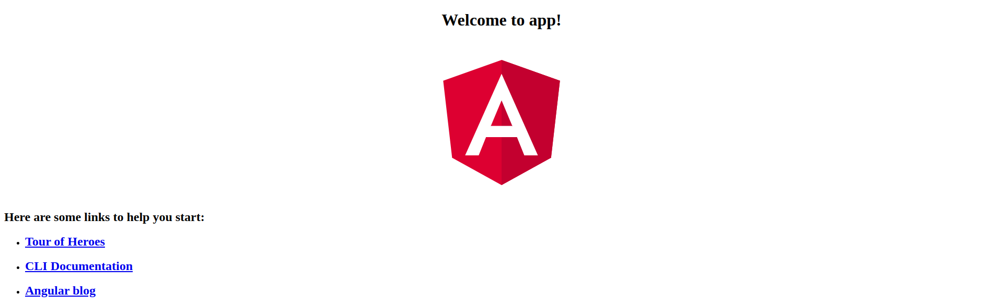

I had an old Angular application to update. Here is what I ran into and how I resolved the issues.

Just try and do this, any maybe why you should not use Angular :-0 can be a bit of maintenance nightmare if it gets too far out of date.

Here is what I was attempting to upgrade from [Angular 6 to Angular 7.2](https://angular.dev/update-guide?v=6.0-7.2&l=1)

## Setup recreating the madness

For starters, I had a project with angular core 6.0.3 and angular cli of 6.0.8

1. Install [nvm](https://github.com/nvm-sh/nvm) if available on your platform of choice. 

2. Then run `nvm install v8.17.0` to install Node.js.

3. Next set the Node.js version to run with the following `nvm use v8.17.0`

before install the version you want you man need to uninstall run `ng --version` then uninstall `npm uninstall -g @angular/cli`

4. Install Angular CLI 6.0.3 with the following: `npm i -g @angular/cli@6.0.3`

5. Start the new old project fresh again: `ng new angular-six-start`

6. `cd angular-six-start/`
 
8. Try to run it `ng serve`

Should see errors like the following:

    ERROR in node_modules/rxjs/internal/types.d.ts(90,44): error TS1005: ';' expected.
    node_modules/rxjs/internal/types.d.ts(90,74): error TS1005: ';' expected.
    node_modules/rxjs/internal/types.d.ts(90,77): error TS1109: Expression expected.
    node_modules/rxjs/internal/types.d.ts(91,52): error TS1005: ';' expected.
    node_modules/rxjs/internal/types.d.ts(91,88): error TS1005: ';' expected.
    node_modules/rxjs/internal/types.d.ts(91,92): error TS1109: Expression expected.

8. Manually Update rxjs version from ^6.0.0 to 6.0.0 in package.json or run `npm install rxjs@6.0.0 --save-exact`

9. Re run `ng serve`

Should have a working project now ;) That looks like this 

10. Now before following the angular upgrade steps
update the installed cli to the latest 6.x release which appears to now be 6.2.9

    npm i -g @angular/cli@6.2.9

11. Update the dev dep cli to 6.2.9

    ng update @angular/cli@6.2.9

12. Then lastly run update angular 7 update as directed

    NG_DISABLE_VERSION_CHECK=1 npx @angular/cli@7 update @angular/cli@7 @angular/core@7

TRy this once more locally but this time change the Node.js 8.17.0a

WORKS on linux mint , but fails on WINDOWS 10 at work

other useful links referenced
https://github.com/angular/angular-cli/tree/v6.2.9

https://angular.io/guide/versions

First run through failed https://stackoverflow.com/questions/56575028/invalid-rule-result-function