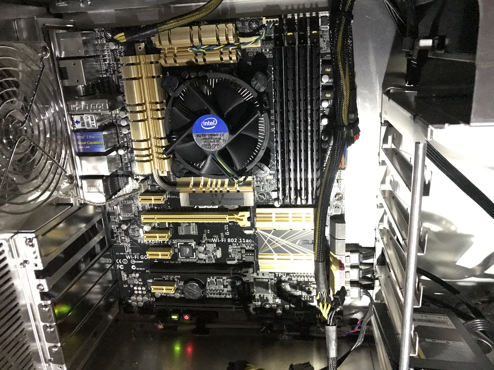

Inherited one of these motherboards with the purchase of a used  [Velocity Micro PC](https://velocitymicro.com/)  which is turning out to be a great [Apple Mac Pro alternative see my Velocity Micro custom PC review](()). Here is my locally saved copy of the user guide PDF and basic reference information and links associated with this board that I keep having to go back too.

## boot sequence special keys

### To enter [BIOS](https://en.wikipedia.org/wiki/BIOS) Settings
- Press <kbd>Delete</kbd> during [Power-On-Self Test (POST)](https://en.wikipedia.org/wiki/Power-on_self-test)

## Locally hosted copy 

[ASUS Z87-DELUXE Motherboard User Guide Specs and Manual - PDF](E7829_Z87_Deluxe.pdf)

## Resource Links

[ASUS Support Z87-DELUXE CPU Support + More](https://www.asus.com/us/supportonly/z87-deluxe/helpdesk_cpu/)