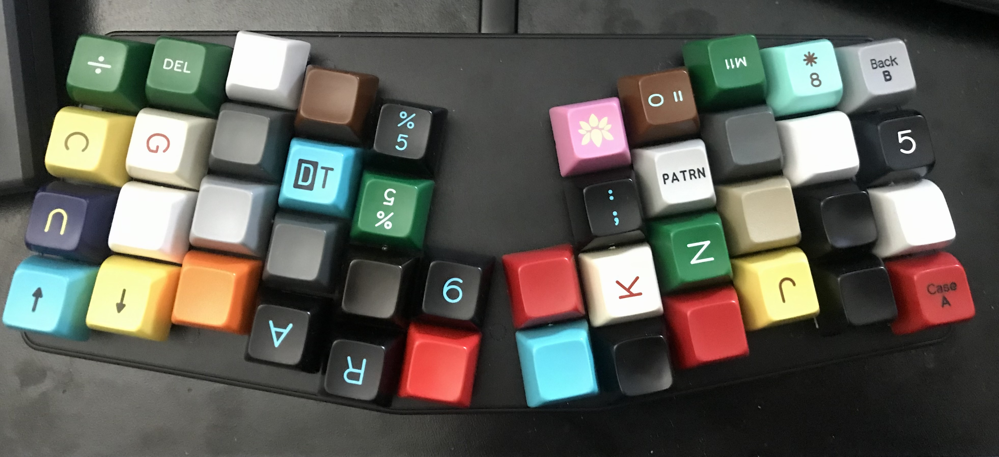
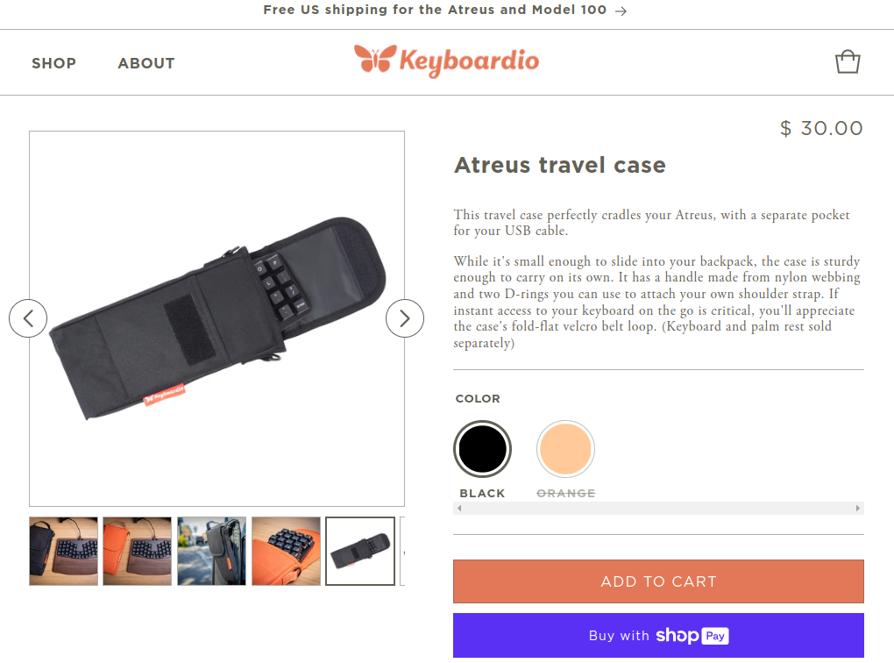
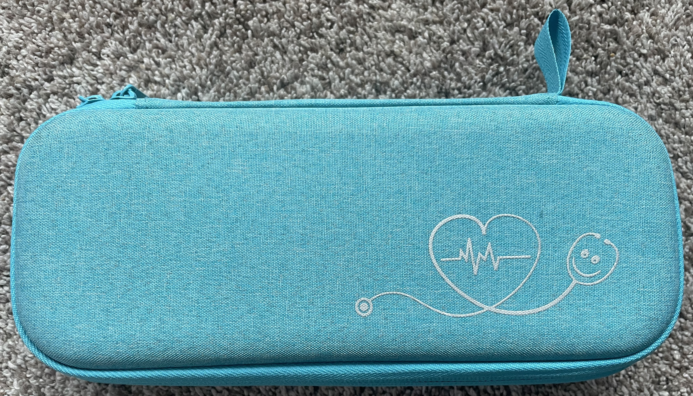
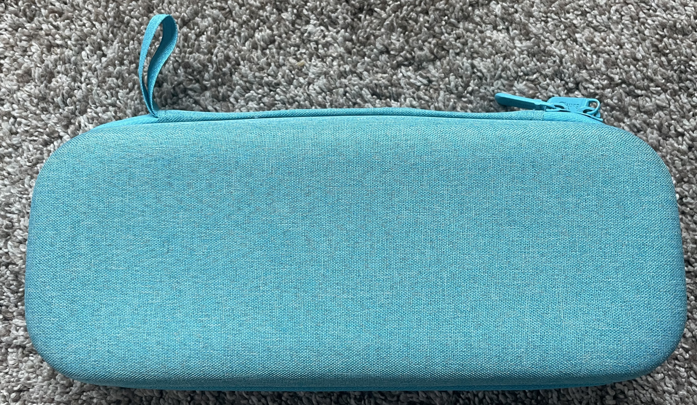

## Problem

I have a Keyboardio Atreus keyboard, its one of the smallest mechanical keyboards I have and of course I would like to 
take it with me to work and while traveling for work. The current problem is I don't want to toss it in my backpack and risk breaking it and or
loosing switches and keycaps in my backpack.

I began looking for a case for a [Keyboardio Atreus keyboard](https://shop.keyboard.io/products/keyboardio-atreus), found this one but did 
not want to spend [$30 on a soft nylon bag style case from the Keyboardio store](https://shop.keyboard.io/products/keyboardio-atreus-travel-case?variant=44336384246051) mainly because for the money this soft case did not seem to provide any more than minimal protection for the keyboard. Also for $30 is a pretty hard sell since I only paid $50 for the entire barebones keyboard on eBay.

## Solution
So I found on reddit that some people have been using stethoscope cases as keyboard cases.  [Reddit - Found the perfect travel case for my atreus](https://www.reddit.com/r/MechanicalKeyboards/comments/5zsjc0/found_the_perfect_travel_case_for_my_atreus/)
So I found and purchased a used stethoscope case on eBay for $10 including shipping.

This case is perfect for this Atreus keyboard and is a semi hard shell material for great protection. If you have one of these keyboards this is an excellent case finding option. Quite the deal at $10 Delivered. I like the mesh bags inside the case as well prevents the keyboard and cabling from falling out of the case too.
