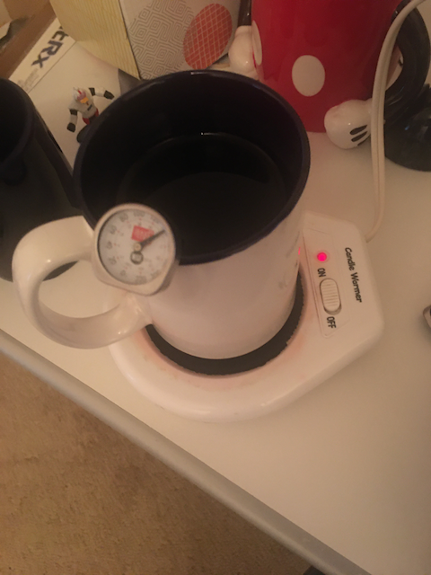
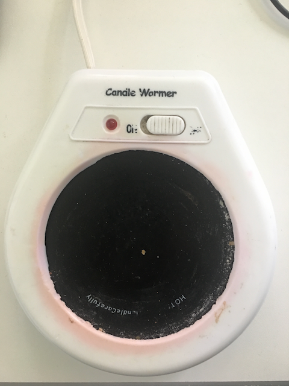
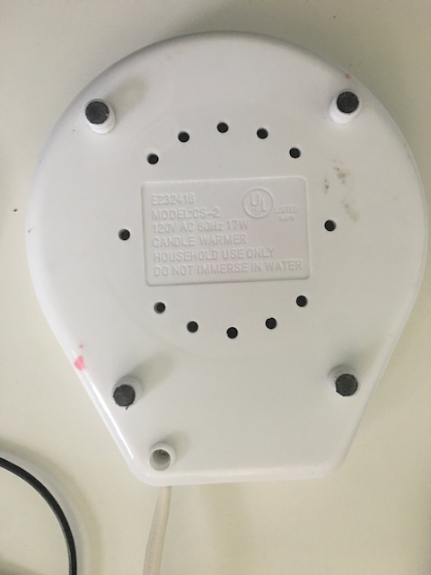
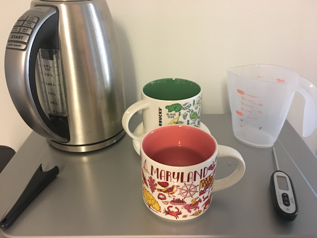

## Introduction Coffee mug warmers

After making a mistake on a smart tech purchase, I quickly was brought up to speed on the topic of mug hot plate warmers for keeping a beverage warm for a extended time. After seeing what they look like from several examples.

 

With that in mind I went to the thrift store and found something close enough in spirit to the mug warmer design. And that was a Candle Warmer, looks identical, how well does it work?

## How Hot does the Candle Warmer keep the drink

First we have a starting temp of 149˚F for both mugs of similar shape and size. Water was heated using a electric kettle to about 160˚F. Both mugs are not flat bottom on the contact surface, so there is only the rings around the edge in direct contact with the heating surface. So this is worst case, and the way most mugs are made. If you have a true flat bottom mug, you can probably expect higher temperatures than whats is displayed below, so your results will vary based on the mug used. If when I get such a mug I will give it a try and see what the results are.

Candle Warmer temperature ˚F | non heated temperature ˚F | minutes  
---|---|---
149 | 149 | 0
126 | 118 | 15
120 | 109 | 30
116 | 94 | 45
112 | 87 | 60
111 | 83 | 75
110 | 78 | 90
109 | 76 | 105
109 | 75 | 120 

Other details important to this experiment. 
Starting room temperature was 68˚F 
Ending room temp 70˚F

I call this a success for me, and with the maintained temperature of around 110˚F. I find that to be a pleasant warm temperature for a beverage. So if my drink is around that long to get to this temperature it works and more than meets my expectations. 

## Can it recover a cold drink? How long does it take?

If you have an already cold / room temperature drink how well does this heat the drink back up.

This is the same plan of testing the temperature every 15 minutes until temperature holds steady.

In this testing environment it took 120 minutes to heat the drink back up to drinkable warm, which I also call a success, a long term one, not really practical, since 2 hours is a long time to wait for a warm drink, but thats not too long in a 8 hour work day.

Candle Warmer mug temperature ˚F | minutes
---|---
73 | 0
89 | 15
96 | 30
102 | 45
106 | 60
108 | 75
109 | 90
110 | 105
111 | 120
111 | 135

Starting room temperature is 72˚F
Ending room temperature is 73˚F

## Conclusion

I call this a success, it works, keeps my drink a drinkable warm temperature, no matter how long it sits on the warmer. Also it looks like there are saving to be had as well buying a candle warmer over an equivalent coffee or beverage warmer plate. I saw a new candle warmer at BI-Mart for $5, which is a great deal, usually the coffee/ drink version can range in price from  around $10 to over $20. So over double for the same deal. Another win for the educated buyer.