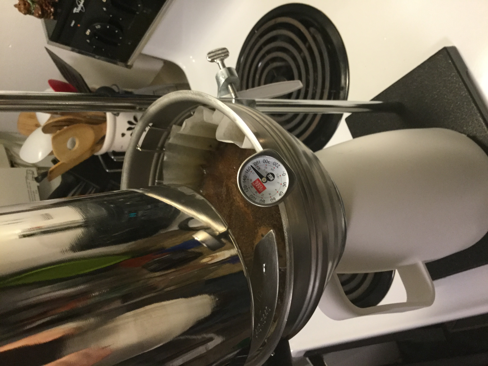
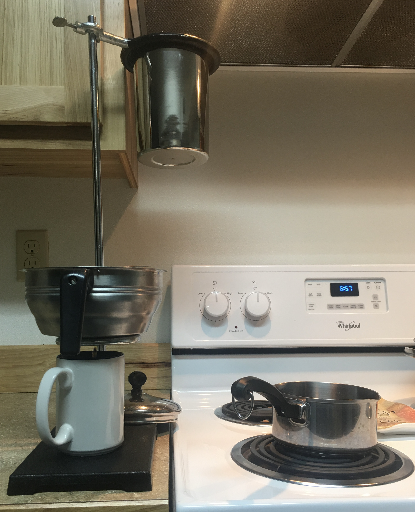
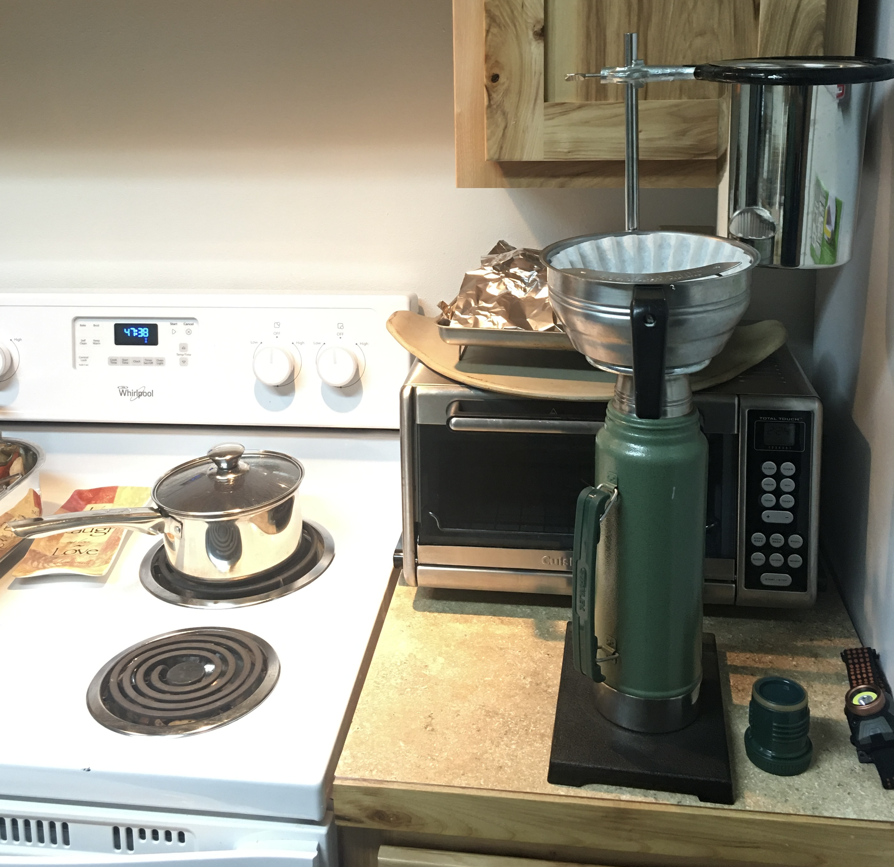
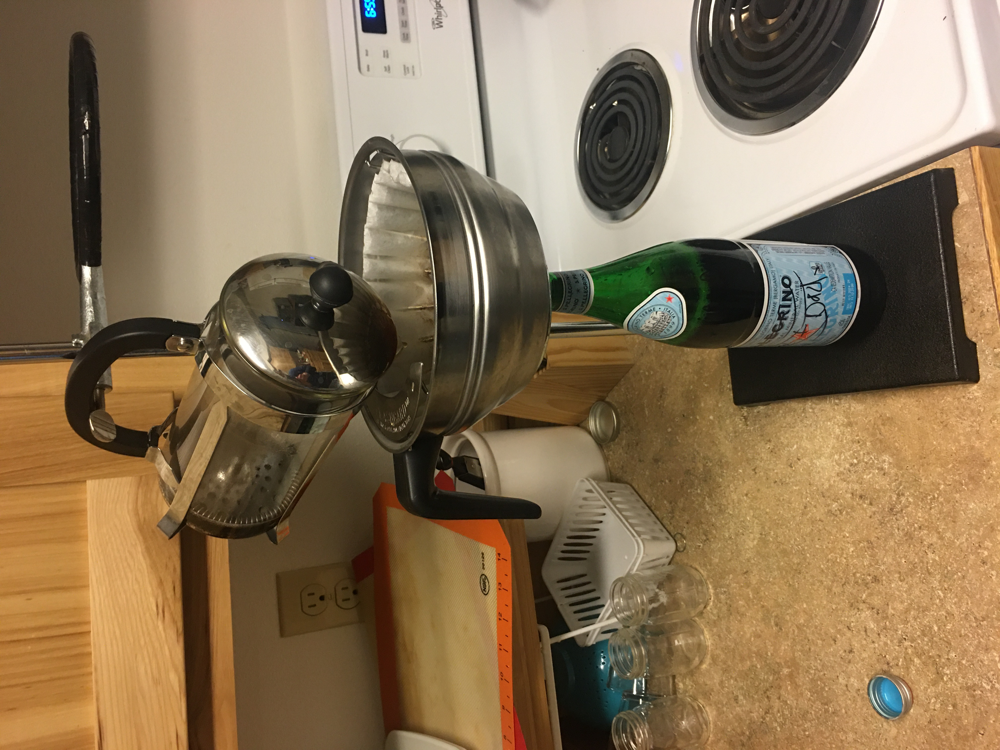

I put this Coffee maker filter stand  together back in the 2010 time frame as an alternative to using many throw away in-expensive coffee makers over a short recurring time frame. Not quite sure how I came up with this, but just kind of put it together, maybe from miss using chemistry lab stuff for cooking.  For more information on how to assemble and build one of these yourself  [Lab Stand Coffee Maker - GitHub ](https://github.com/djbrieck/coffee-maker)

# Drip mode

While this worked for months, it had some downsides, random water flow when first starting, causing hot water to at first out and miss the filter basket for about a splash of water. But otherwise it worked and had very little that could break. Also, the other downside is that the unit is quite tall with the lab stand pole height and just how tall the unit is when configure to drip brew.

# Pour over mode
Remove or swing away the Inset pan and top ring

Keep in place the filter basket and smaller ring stand, adjust ring up or down to fit filtering into whatever your using from mugs to insulated thermos bottle.

This is great for making single to many serve pour over hot coffee, filtered cowboy coffee or for filtering cold brew, instant pot  hot coffee, or other things you may want to filter like loose-leaf tea or anything liquid food related.

# Other uses

Use the rings to hold funnels or support freezer bags useful in storing food to place in the freeze, etc.

