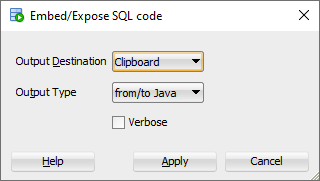

If your using [Oracle SQL Developer](https://www.oracle.com/database/sqldeveloper/) to write and test query's that you 
will use in a Java or Python program this will be a handy tip, you don't have to do this manually.

1. In your current Worksheet right click and select "Embed/Expose..." Or press keyboard shortcut <kbd>Ctrl</kbd> + 
<kbd>Shift</kbd> + <kbd>F7</kbd>

   

2.  Set the output destination to "Clipboard" otherwise conversion will be done over your existing worksheet SQL.

3. Select Output Type  To / From Java or Python

4. Click `Apply` button.

5. Finally, paste the conversion where you need it at.