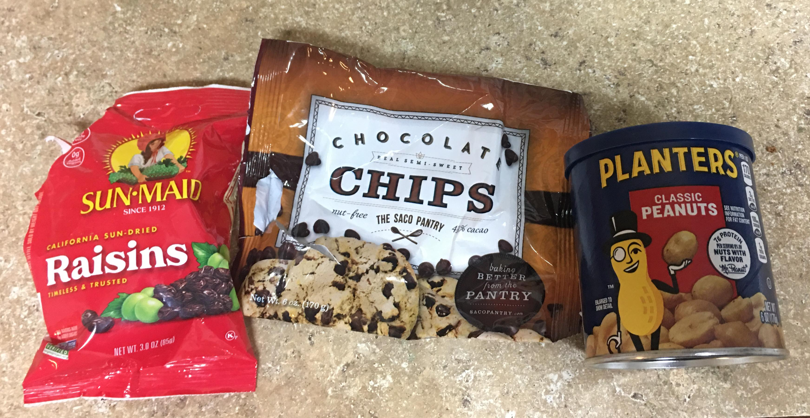

Another example of grab the materials and combine yourself to enjoy a savings and surplus for the money spent.

Today this example was at a local Dollar Tree, but any value store will offer a deal similar.

Taking note that the pre maid trail mix bags in Dollar Tree currently cost $1.25 per bag, for 2.5 oz of product.

Simplifying things I just grabbed the following three products off the shelf to make my own trail mix in a pretty large quantity when compared to the individual packs and a much shorter ingredient list too.

- 6 oz Planters Classic Peanuts

- 3 oz Sun Main Raisins 

- 6 oz Saco Pantry Semi Sweet Chocolate Chips

And if you're not prepared to contain all the food you will need a pack of Quart storage bags to contain and mix the ingredients so add ($1.25) for that if needed.

So I spend 3.75 to buy all the ingredients + $1.25 to get the storage bags, since I did not have a clean container large enough to contain the ingredients and store them air tight in the car while on a quick trip. 

$5.00 for 15oz  of trail mix. To get the same with pre maid in store would have taken six bags for a total of $7.50 (at $1.25 per 2.5oz bag).

So making it your self saved you $2.50 or $3.75 next time if your already have bags.

Enjoy the saving and feel free to be inspired to customize and mix what is available in your local stores .