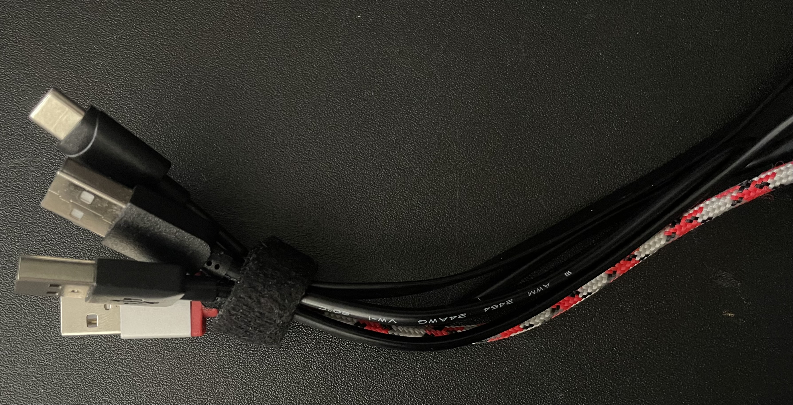
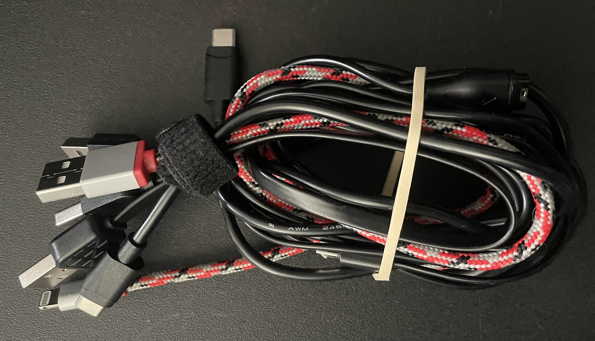

This is DIY bundle of cords, this is not about making a custom one to many charging cord.

This is a way to keep all the charging cords you need bundled together in your travel bag. This will help with the problem of pulling out one cable and having 3 other random cables coming with it and falling out of the bag pocket and possibly getting lost.

## Supplies required:
    - All the usb cables  you need for travel
    - Velcro cables tie/s 1 required, second one optional

# How to make your own bundle of travel cords?

1. Gather All the cords you need and do your best to unwrap and untangle them.

2. Position all the cords gathering all the ends that would plug into the USB charger or computer.

3. Tightly gather the collected ends and install the cable tie around all.

    

4. Now all the cords are bundled together by one end , roll  and fold the cords together

5. Place in small pocket in your travel bag or add second cable tie around whole bundle then place in larger compartment in your travel bag.
    

