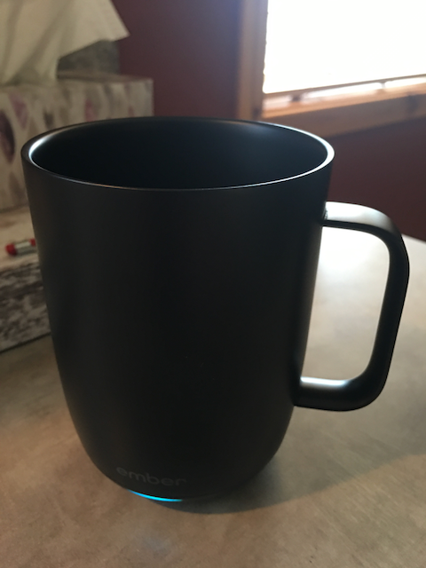
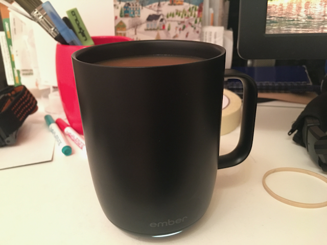
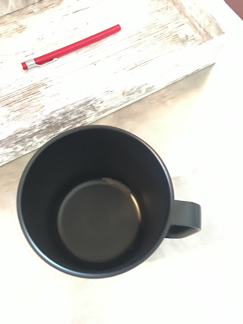
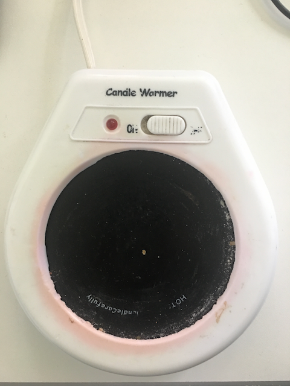
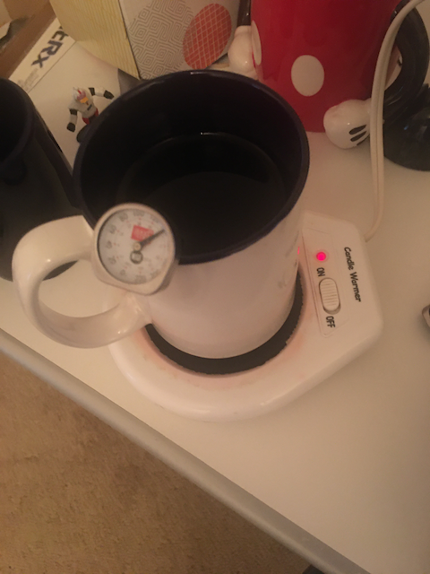

 I first received the ember mug as a gift for Christmas of 2020 from my Lovely wife, Darcy, Thanks.

At first, I was aghast by the concept of a $100+ USD smart mug, but I decided to give it a try, and I am glad I did. I believe this was an older model or Costco buying up old stock in bulk, but the current gen Mug2 is $150+, which is just bonkers!

For the most part after its all working and setup it is an amazing experience, especially with teas and drinks that are best enjoyed sipped slowly. This is one of those things that you don't appreciate until you have tried it. A drink that never gets too cold  and stays at the temperature you set it at, is quite nice.

I figured out that I enjoy a temp around 122˚F while using this ember Mug.

The app experience was ok sometimes did not connect and was a hassle sometimes to get and change the temperature on the mug, but that's typical with smart things, right.

Other than the manual temp settings the other parts of the app are not memorable, but I think it had preset temps for kinds of drinks, and what color you want the LED to show at various times.

The charging device can be very touchy on charging on its coaster base with electrical contacts that should not get wet, lol. In other words it does not charge unless it's perfectly aligned with the contact rings on the button of the mug.

The indicator light is not visible if your using your left hand to hold the mug, since the light is only on the one side visible when you hold the mug in your right hand.

But the main experience is that your drink stays at the temperature you set it and that is quite fantastic, and is quite a luxuriant experience. 

Also makes you more mindful of hey your drink is too hot wait til it cools down first, before you burn yourself. The indicator LED shows when the drink is ready at your set temperature, which is fantastic.

## Durability concerns

I was suspecting from the beginning that this product would end in disappointment, but I was concerned over a failed battery that would be hard to replace many years down the line, or lack of software support rendering the thing useless.

Wow, was I wrong and on the timeline, never would have called the paint and finish failing by March 11, 2021.

 

Sure I may have used a spoon / drink mixer to carefully stir the coffee / tea or cocoa in the mug. Apparently that was too much for this fancy gadgets low quality finish. 

And again making a product this fragile e.g. painting it, instead of leaving it bare metal, just goes to show the consumer that the company really want to blame the consumer and make you need to buy a new one, since you used your mug wrong and the warranty is now void. That said you can't use it like a normal mug, bad enough you can't put it int the dishwasher nor submerge it in dish water. So that is kind of a joke, on top of all the other restrictions and cautions of having this mug. Good luck not breaking it, if this is something you must have. And while I was looking at the next gen ember travel mug, it said to avoid MCT oil on the plastic lid for the travel mug, laughable man! So ya just put in on a shelf and don't use it, since you may use it wrong and have to take the blame for this product failing on you.

## Returned it

Luckily we purchased this product from Costco and had no issues returning this less than practical implementation of a temperature controlled mug.

## The smart replacement

After talking to some friends about what happened I quickly got introduced to the concept of a heated mug warmer plate. For example the Mr. Coffee Mug warmer. After looking at what the device is it was on my mind to find something. And there are tons of choices available online with prices from $10 - $55 USD.

I went to a local thrift store People Helping People  the next chance I got and found exactly what I was looking for. Labeled no less as a Candle Warmer it's basically the same device as the coffee warmer hot plate, even using a similar 15-20 watts of power. Picked it up for $1 USD. And  now I can keep my drinks warm for hours at a very low price. Sure I loose precise temperature control, however having tried this candle warmer, I am finding that precise temperature control is not really needed. [(See my in-depth experiment to see how well my $1 replacement device works.)]() As long as  I am not getting burned on every sip precise temperature control is not really needed, the difference between 110 and 122 is not noticeable in the long run.

There is a nice list of other benefits too:

- I can now continue using my favorite existing durable mugs.

- And additionally if I want to insure my drinks are not too hot I can use a manual temperature probe inserted into the glass to see when it is ready to drink thus getting that ember feature back, in a simple and low-cost way.
    

- Now this whole rig is not as portable as the ember was, but for 90% of my usage I had it sitting on the charger on my desk keeping my mug warm. And with the ember if I was not careful setting down the mug, it might not be charging and instead running the battery down, which in a short while would lead to a dead battery and cold drink anyway.

- If I really need portability, I can dump my perfect temp beverage into a well insulated travel mug to maintain the temperature, so it does not get cold as would happen much faster in the open glass or ceramic mug.  To do this right make sure you dump hot water 160˚F to 212˚F into the travel mug to warm it up first, then dump your perfect temp beverage into the travel mug after discarding the hot water. Otherwise, the travel mug will suck some of the temperature from your perfect temp beverage potentially making it cooler than you would prefer.

## Improvement the Ember stuff needs to have to make them more worth it for me to buy:

- Product needs to be durable, metal spoons stir all you want and feel free to dunk it in the sink.

- It needs to be user serviceable when the battery goes out.

- Also dare I say an Open API / firmware, so you can program it to do what you want, so you not dependent on ember keeping the thing running.

- Manual controls / temp display on the device itself, who needs an app but it can be there if you want it, just more stuff to maintain. 

- Lastly maybe this product is one that we don't really need. I found a $2 solution that already exists (including the price of a used mug)that delivers a similar experience, and the best part is you control all the choices with this path [(see my in-depth experiment to see how well my $1 replacement device works)]()

## Conclusion

While the ember allowed me to gain an appreciation of how luxuriant a indefinitely warm beverage could be at a precise temperature. I have to say embers implementation needs tremendous improvement, and I can not recommend purchasing this device, since no matter how well the thing works now, its going to have a disappointing end, and your going to need to spend another $100+ to keep this dream going. Thats not sustainable, and frankly its a product that I can't support, especially when $1 gets you a good solution. 