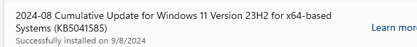
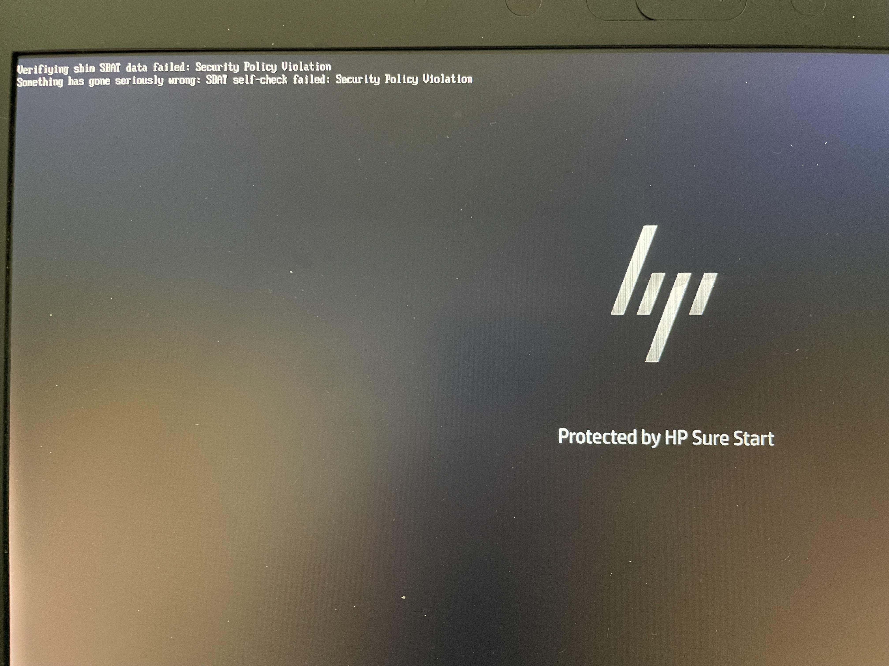
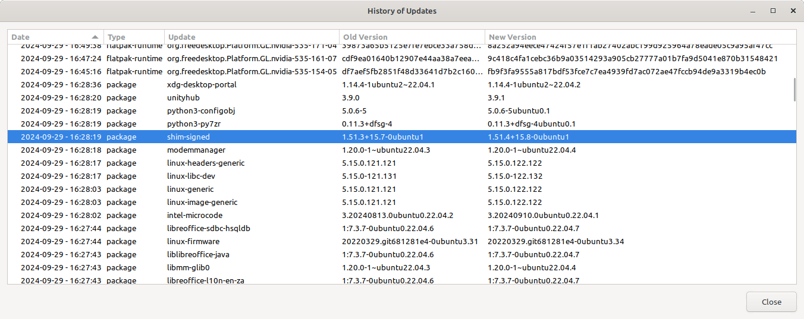

## Introduction 

After some recent updates where installed by Microsoft for Windows 11 Pro [Microsoft 2024-08 Cumulative Update for Windows 11 Version 23H2 for x64-based Systems (KB5041585)](https://support.microsoft.com/en-us/topic/august-13-2024-kb5041585-os-builds-22621-4037-and-22631-4037-76655cde-e2ee-49d4-a415-cf9a4d3c3a04), this is what happened when my laptop rebooted with Linux Mint 21.3 dual boot.

Effectively Linux Mint was no longer considered trusted and the laptop refused to boot from Linux or anything. The system would show the follow error and then immediately power off.

`Verifying shim SBAT data failed: Security Policy Violation Something has gone seriously wrong: SBAT self-check failed: Security Policy Violation`

First got the error on Sept 8 2024.

## The temporary work around

After doing some [searching around on the error](https://search.brave.com/search?q=Verifying+shim+SBAT+data+failed%3A+Security+Policy+Violation+Something+has+gone+seriously+wrong%3A+SBAT+self-check+failed%3A+Security+Policy+Violation&source=desktop) it became clear to me that this was a secure boot problem. [Linux Mint Forums - Verifying shim SBAT data failed: Security Policy Violation](https://forums.linuxmint.com/viewtopic.php?t=427297) And maybe I could just disable secure boot in the BIOS setting on my laptop.

# Disable secure boot on my HP Elite Book 840 G5. 

1. Held down `F10` to Enter Computer setup. 

2. Find the option in the BIOS menus to disabled secure boot

3. Set the setting to Disabled Secure boot. 

4. Saved the bios changes and rebooted the laptop.

The laptop rebooted and Linux Mint and Windows 11 were both able to be selected to boot from as usual the error message was gone and I now had a functioning computer again.

## The fix 

Since I disabled secure boot I paid close attention to all the updates descriptions that were in the Update Manager on Linux Mint 21.3. several weeks later on September 29th I noticed one updated package [shim-signed](https://ubuntu.pkgs.org/24.04/ubuntu-main-amd64/shim-signed_1.58+15.8-0ubuntu1_amd64.deb.html) description has some wording mentioning a Microsoft signed shim patch.

`This package contains the version of the bootloader binary signed by the
Microsoft UEFI CA.`

After reading and installing the updates I tried the following to see if secure boot would work again.

# Re-enable secure boot on HP Elite Book 840 G5.

1. Held down F10 to Enter Computer setup.

2. Find the option in the BIOS menus for secure boot

3. Set the setting to Enable Secure boot.

4. Saved the bios changes and rebooted the laptop.
   
After I  re-enabled secure boot, the laptop worked error free again and all was well again with "secure" boot enabled.
