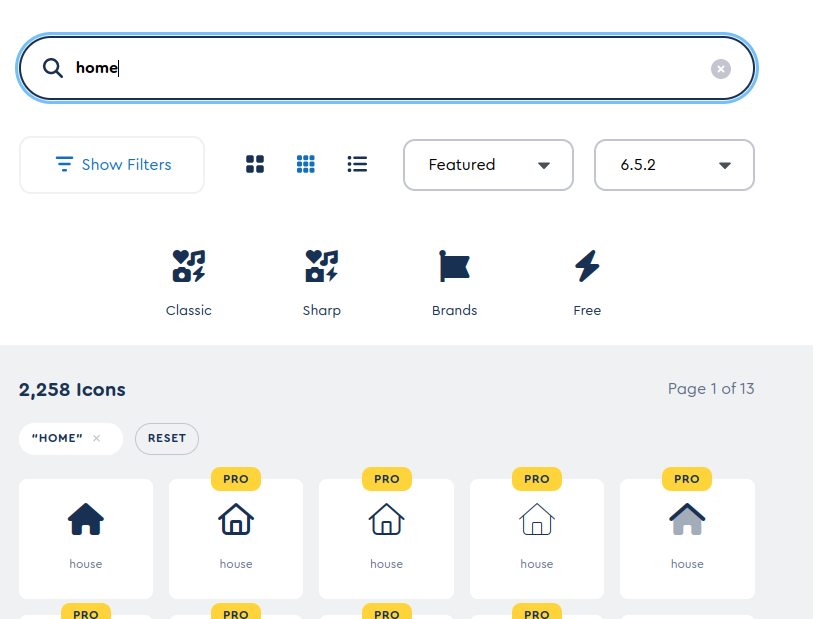

I was updating the [font awesome](https://fontawesome.com/) version on a work project when upgrading Angular and ran into a simple problem that wasted a lot of time.

I was getting this error on the console at runtime:

    ERROR Error: Could not find icon with iconName=home and prefix=fas in the icon library.

Since faHome was imported without an error in typescript / javascript, this turned into a fix at run-time problem.

    import { faHome } from @fortawesome/free-solid-svg-icons

    <fa-icon icon="home"></fa-icon>

The fix after closer re-examination was that `home` was renamed to `house` in Font Awesome 6.5.1+ of the free-solid-svg-icons and I missed that change.

The fix was updating the naming:

    import { faHouse } from @fortawesome/free-solid-svg-icons

    <fa-icon icon="house"></fa-icon>

If your seeing something like the above error [try searching again for the icon your looking for in the Font Awesome library](https://fontawesome.com/icons) and pay attention to the version of the svg-icons your searching and using and make sure the search and results name are matching, since things were probably renamed like they were in this case for `home`.

