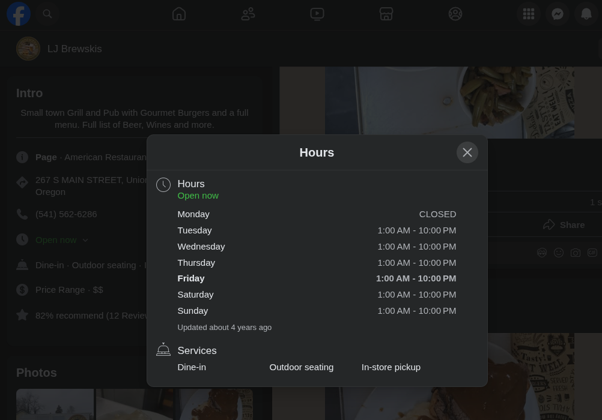
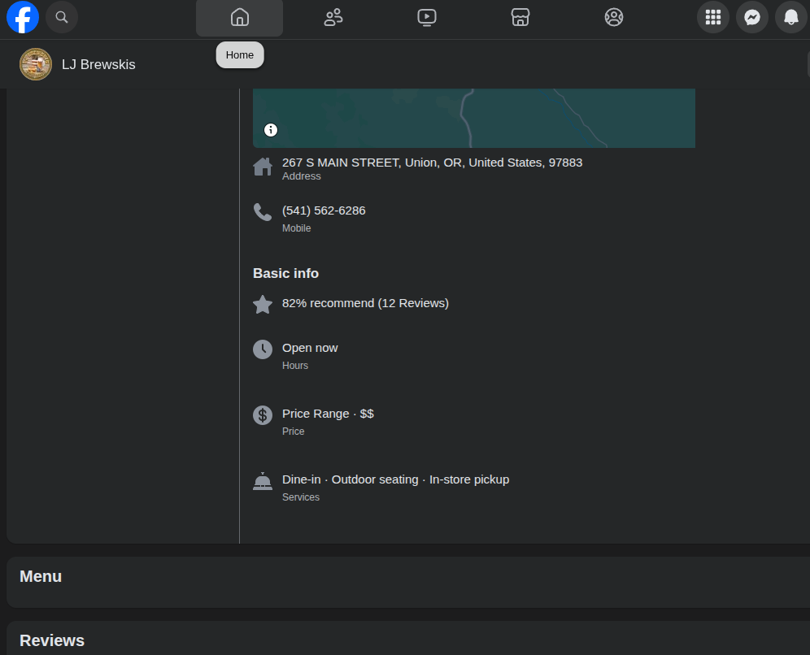
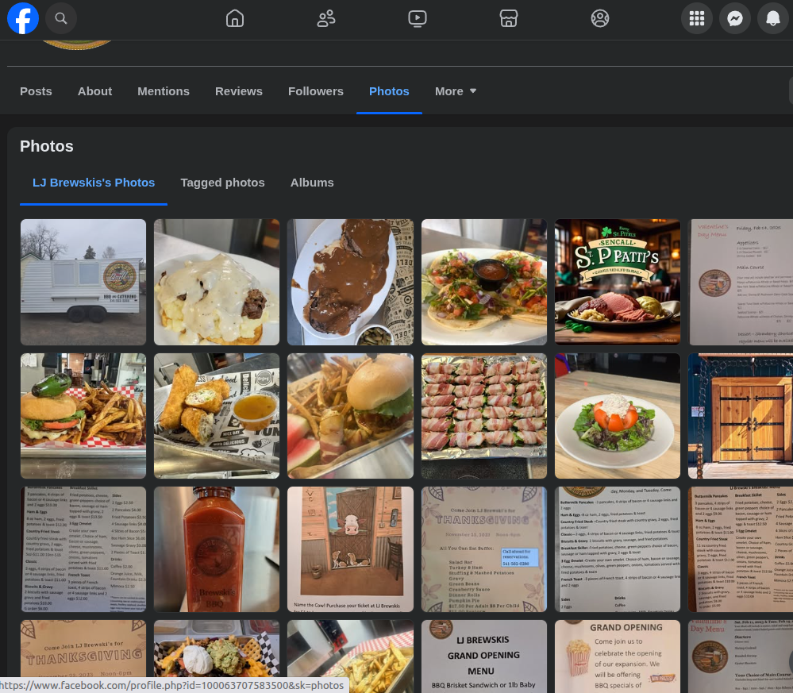

I have been pretty frustrated with finding information on local business, so I took action to make this better and at no cost to the businesses too. I think a lack of website is possibly due to the excessive costs and fees sometimes associated with running building and maintaining a website.  Most places just don't bother to take the time and effort to maintain a website and domain. For example back in 2020 a local restaurant LJ Brewskis had a website, but as of 2025, it no longer has one.

Many places use [Facebook's business pages](https://www.facebook.com/business/help/1968057156746246?id=939256796236247) or other free listing like Google, Yelp, etc. Facebook has its own issues, but mainly it seems to be inconsistent and complicated to set up the pages. And for customers Facebook requires customers looking for information to login to Facebook before they can view complete information on a business. Also, it may require you to use the Facebook smartphone app and may otherwise make it difficult to find what your looking for. Most commonly I am looking for business hours, a menu, address, phone number and other basic information and often Facebook makes that a challenge and excessively frustrating to get to. 

## LJ Brewskis local Example of a Facebook business page experience

### Not Logged-in experience

If your not logged in your soon forced to log in usually well before you find what you are looking for, and if you don't have a facebook account you don't have access to the information.

### Logged-in experience

And like that [Cab Driver said in Home Alone 2](https://www.imdb.com/title/tt0104431/characters/nm0865356/) "Ain't much better in here..." the same is true once your logged into Facebook, you really have to search around to still find what your looking for. And as noted here even the hours are not accurate to whats was posted in the door.

Wait they don't open at 1 AM???

The next chore is finding the menu, some pages have a menu listed here, they had one all the menus were posted, just some rotate 90 degree off, now thats all gone.

The only thing you can do now is browse through the photos or posts and hope to find the most current menu.

For example searching through photos or posts for menus is something that is often necessary for most businesses, and each business facebook page is set up differently.

## Here is a solution that I built

[LJ-Brewskis (Un-official)](https://k51qzi5uqu5dlr44wospfhm3h896r5hlml2ctjnf1lvyr9kth119np0gar4sx0.ipns.dweb.link/)

Now once you get passed the possible slow load time since this is freely self-hosted using IPFS. You will find a pure and simple page no fluff, just the facts and the stuff you are looking for, and there is no login or Facebook or anything required of the visitor other than a browser and internet. 

So I am taking it into my own hands to build dirt simple free websites that are hosted on IPFS or wherever and therefore do not need tradition domain name fees. These are pure content and require minimal effort to maintain and update. About 3 hours of work to make each site. Since I would rather see a basic website than nothing at all for most places I would like to do business with. Feel free to follow this guide and do the same in your local area. So instead of searching each time  gather and create something useful for yourself and others to use as well.

# how to build a basic just the facts website.

1. Use HTML boilerplate or fork one of my examples to get started no need to overcomplicate things some information is better than none.

2. Added  basics information to the index.html file with the following text template outline.

Location:

Email

Phone:

Hours:

Links

Menu
Provide PDF menu links

	Provide Plain text  menu file links

================

The sections in detail to include.

Add or leave out sections as needed this is just a basic starting point of the minimal useful information that should be easily provided feel free to omit things that are missing.

## Location

For the location add the physical address of the business in a selectable manner so someone can select copy and paste it with easy.

## Email

Provide email information in a mail to link format if an email address is available

4 Links to Facebook, etc and websites if they have any official links 