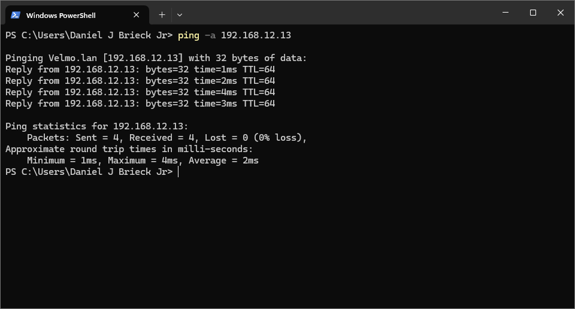

This can be done using the standard [ping](https://learn.microsoft.com/en-us/windows-server/administration/windows-commands/ping) command on [Windows](https://en.wikipedia.org/wiki/Microsoft_Windows).

Use the `-a` or `/a` option which "Specifies reverse name resolution be performed on the destination [IP](https://en.wikipedia.org/wiki/IP_address) address" which will provide a host-name if the reverse name resolution is successful.

    ping -a w.x.y.z  
    
Where w,x,y,z are the numbers for your [IPv4](https://en.wikipedia.org/wiki/IPv4) address you want to get the host name for, this does not work for [IPv6](https://en.wikipedia.org/wiki/IPv6) address.

## Run Example here:

## Reference

[ping on Microsoft Learn](https://learn.microsoft.com/en-us/windows-server/administration/windows-commands/ping)

[Resolve host name from IP address](https://serverfault.com/questions/74042/resolve-host-name-from-ip-address)