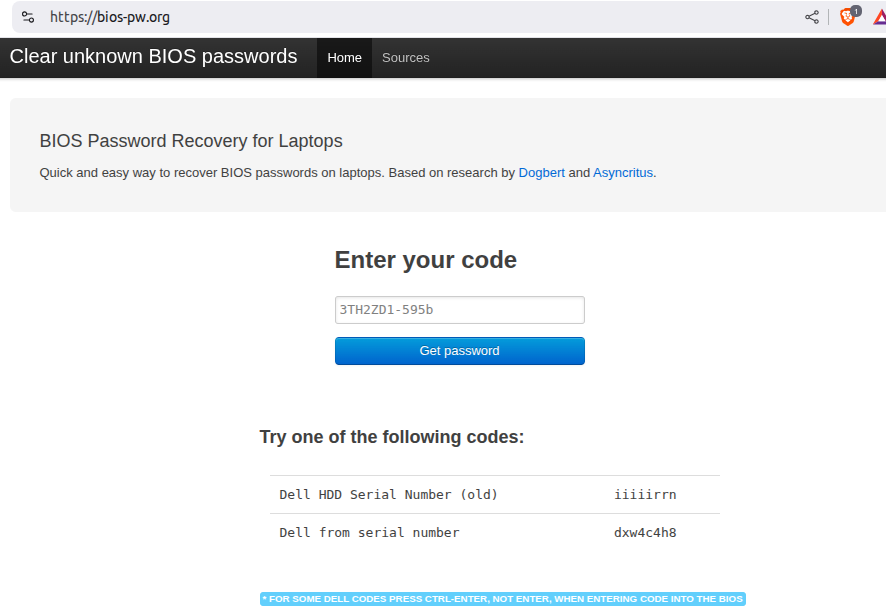

# Introduction

If your faced with a laptop that has a [BIOS](https://en.wikipedia.org/wiki/BIOS) password preventing anything from occurring on that laptop, here is a fix that worked for a 2007 era vintage Dell Inspiron 1720.

This machine had been sitting with little to no use for years, upon trying to get the system to boot it prompted for a password and the system refused to boot without a valid admin password. Which means you have 3 tries before the system just powers off, repeat.

I tried many things even doing all the following as suggest by [Copilot](https://copilot.microsoft.com/shares/dTYp5doDRkxF9YaLVmhSi) and several other internet searches, most disappointingly Dell support refused to help since the machine was most importantly "Thank you for writing back to us, we see that you are looking for the system BIOS password, but we would to inform you that the system for which you are looking for the BIOS password is already 17 Years, 255 Days Old and for us the system is on its End of life or obsolete and there is nothing, we can do to resolve the current issue and if you want you can contact a local technician for the same."

## A solution that worked

I finally found the fix  after doing a new searching something like "Clear BIOS password" which lead me to discover the [Clear unknown BIOS passwords](https://bios-pw.org/). 

1. Visit  [BIOS Master Password Generator for Laptops](https://bios-pw.org/)

2. Entered the computer info as appropriate for your computer manufacture for this DELL as pictured it was `3TH2ZD1-595b`

4. Press the  `Get password` button

5. I used one of the codes suggested under
"Try one of the following codes:"

6. The one listed next to "Dell from serial number" worked for this laptop as a valid password

7. Then I held down the <kbd>F2</kbd> to enter step up, proceeded to the Security section and then cleared all the BIOS password that were set, reusing the password the service generated as prompted to clear the admin passwords set.

## Conclusion 

I think the BIOS password is one of the most unhelpful and silly things that can be enabled on a PC, and can easily lead to a stuck situation like this. I am glad there was a workaround to disable this, as I  was running out of options. Many thanks to bios-pw.org the only thing that worked and saved the old laptop from salvage.
