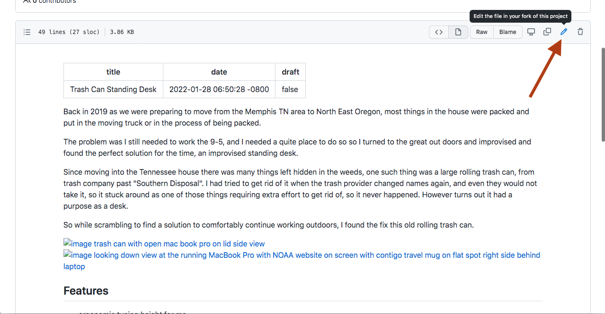
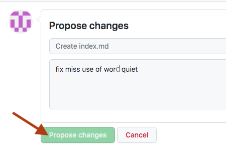
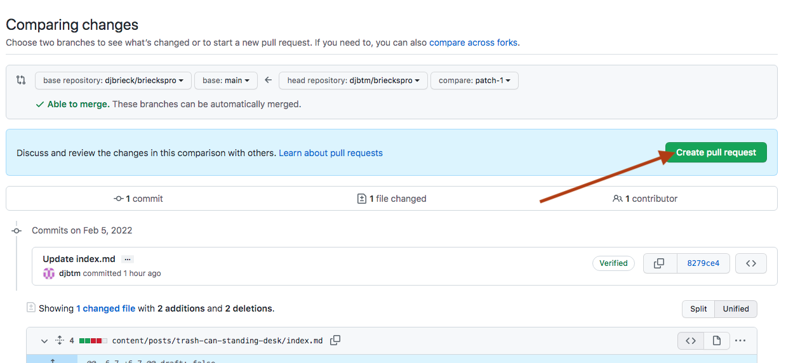
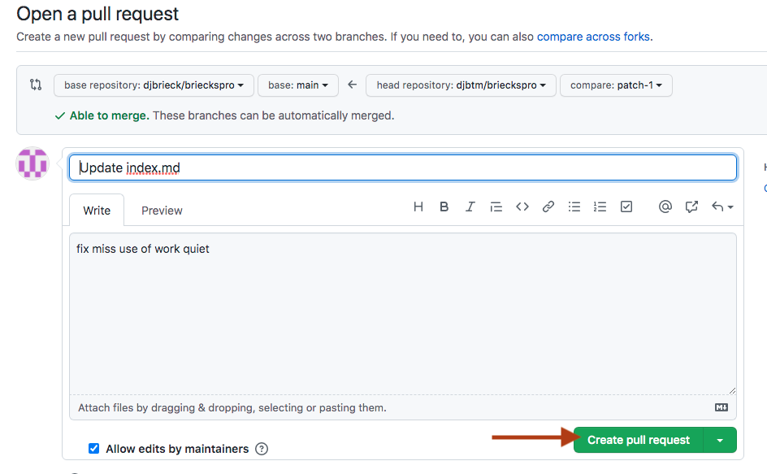

Thank you for accepting the challenge of helping me to make this site better. 

There are two requirements to get started. First you will need to have a [GitHub account](https://github.com/). And secondly be familiar 
with [Markdown syntax](https://www.markdownguide.org/getting-started/), all the context and posts are written in this format.

## How to Fork a GitHub project and make some changes

1. Visit [GitHub](https://github.com/) and login if you already have an account. Otherwise, click the "Sign Up" and make a new free 
account. 

2. Once your logged into gitHub, then in the same browser open the source code repository for [Brieck's Pro](https://github.com/djbrieck/brieckspro). 

3. Find the content that you want to modify. Pretty much 100% of the content is located in the [content directory](https://github.com/djbrieck/brieckspro/tree/main/content) 

4. Click the edit icon and begin editing, you can do so right in the browser window. 
    

5. When finished with your proposed fixes, scroll down and enter a comment in the propose change box and then click the "Propose changes"  button. 
      

6. Compare the changes and when ready click the "Create pull request" button.
    

7. Fill in any additional comments  and click the "Create pull request" button once more.
    

Once that pull request is submitted then thats all there is for you to do. Thank you!

Then I will be in touch via github comments on how to get you your payment sent to your lightning wallet, etc.

