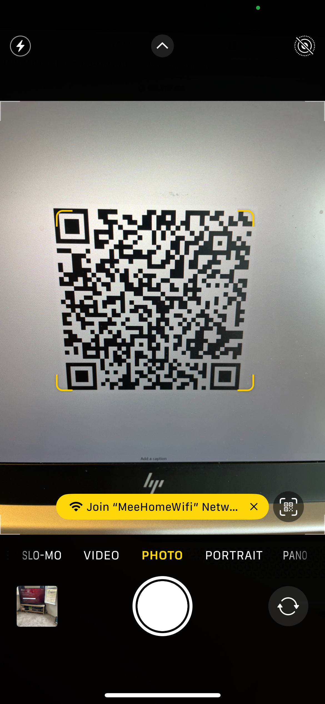
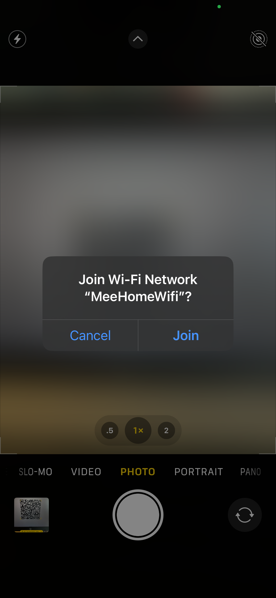
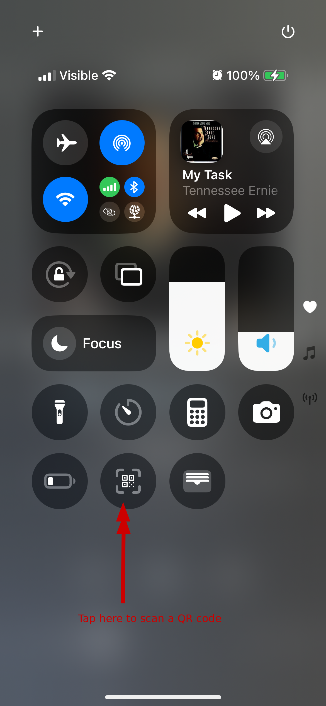
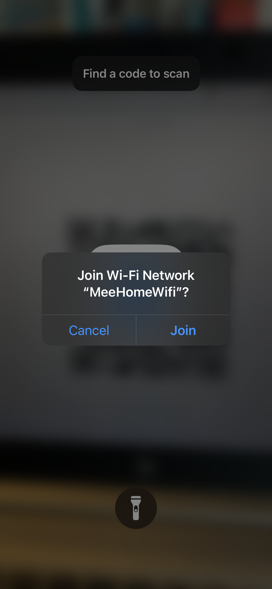
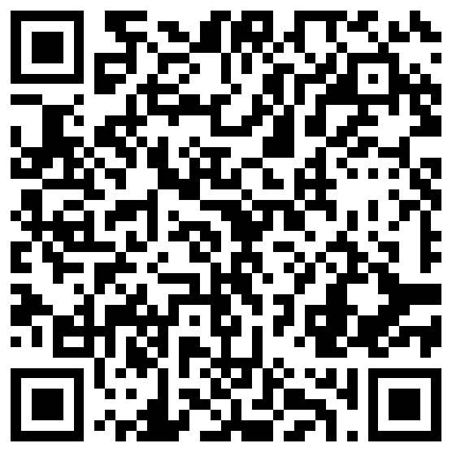

This was a mystery to many myself included, but I say it is possible to connect to Wi-Fi using a QR code. It's not well 
advertised by Apple. And  most of the time 
[Apples built in magical automatic Wi-Fi password sharing works as follows](https://support.apple.com/en-gb/102635). 
That in short is where you try to connect to Wi-Fi and then someone near you also on an Apple device can click a prompt 
and share the password to you. Sometimes this does not work and in those cases here is the QR option, that always works 
no Apple hidden magic needed.

There are at least two ways to connect to Wi-Fi using a Wi-Fi QR Code on most iPhones and iPads that I have discovered thus far:

## Using the Camera App

1. Open the Camera App

2. Point camera at QR code for Wi-Fi

    

3. Touch the yellow Link that shows up in this example its labeled "Join MeeHomeWifi Netw..." then you should see something like.
   
   

4. Click "Join" to connect to the network as advertised and expected for your environment.

## Using the Scan QR Code Control Center widget.

You may need to add the Scan QR widget if one is not present see [Customize  Control Center](https://support.apple.com/guide/iphone/use-and-customize-control-center-iph59095ec58/ios)

1. Open [Control Center](https://support.apple.com/en-us/108330)
   

2. Tap the Scan QR Code icon and a camera like view opens made for scanning QRs

   

3. Point camera at a Wi-Fi QR code

4. Click "Join" to connect to the network as advertised and expected for your environment.

## A Note on the QR Pictured its no secret I know

The QR in this post pictured above is an example one with the following information embedded, feel free to use it to 
test, fear not this is not an actual Wi-Fi network I use. I will show in a later post how to generate your own QR codes 
just like this one using an iPhone or iPad.

   SSID:`MeeHomeWifi`
   Password:`yLTnxcrPnEWCM0LWoFBv`

RAW QR text this is what your devices reads to be able to connect to Wi-Fi:  
`WIFI:S:MeeHomeWifi;T:WPA;P:yLTnxcrPnEWCM0LWoFBv;;` courtesy of [ScanQR.org](https://scanqr.org/)
