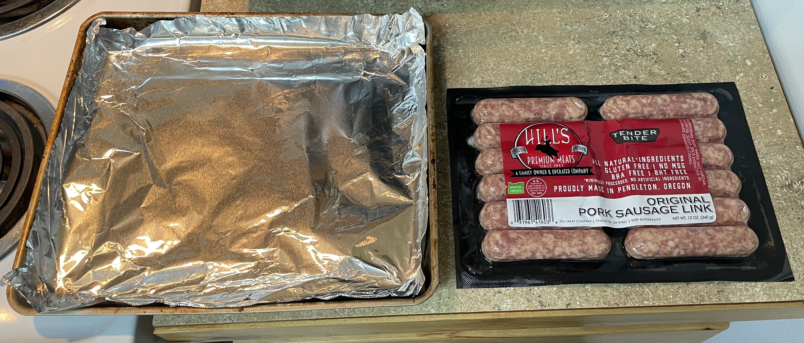
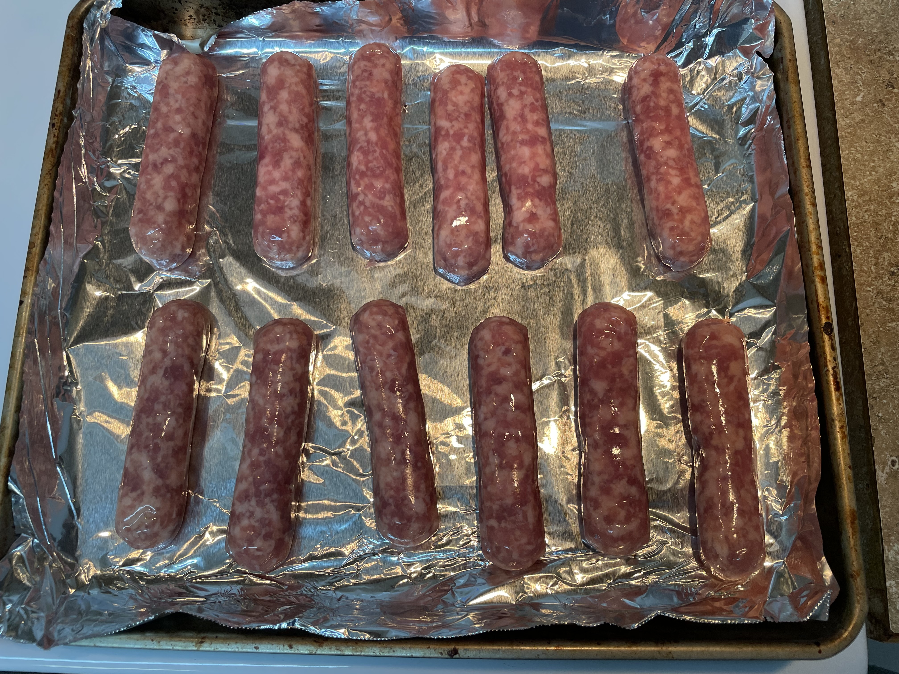
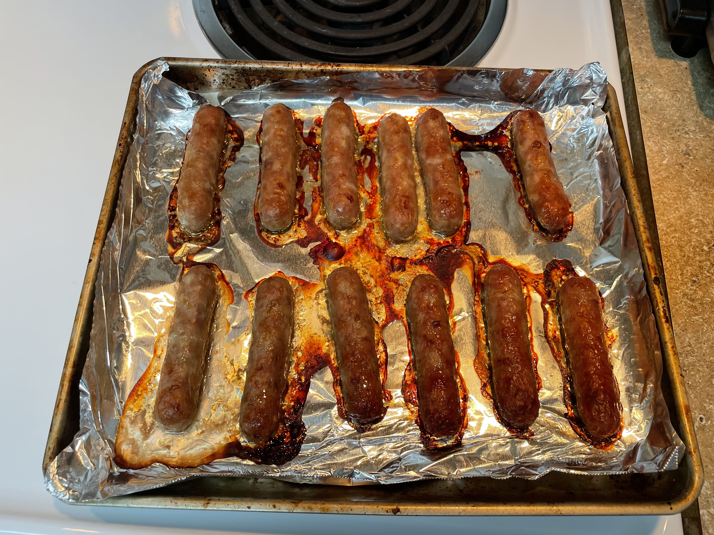

This is an alternative to making those sausage links in the frying pan, this is much easier to clean up method. Also, this works just the same in a toaster oven too. See pictures for how the toaster over works

1. Start with non-frozen sausage links. 

2. Set oven to bake at 400 degrees Fahrenheit 

3. Line baking / cooking sheet with foil

4. Arrange sausage on the pan so they are all separated from each other.

5. Bake for 30 minutes

5. Remove tray from oven, and use tongs to carefully unstick the links from the foil.

## Reference

[How to Cook Sausage In The Oven](https://brooklynfarmgirl.com/how-to-cook-sausage-in-the-oven/)