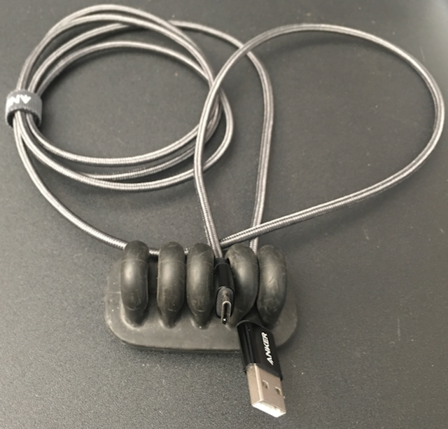
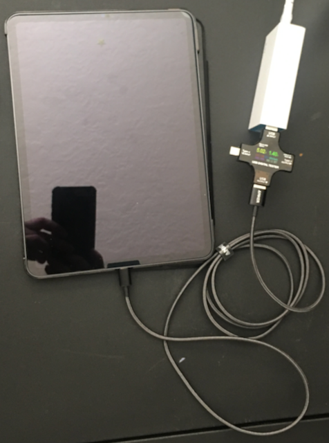
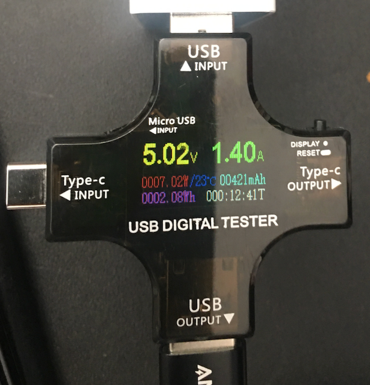
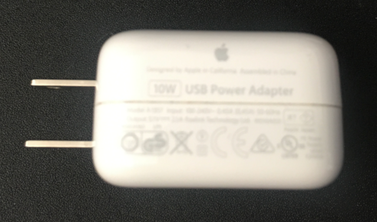
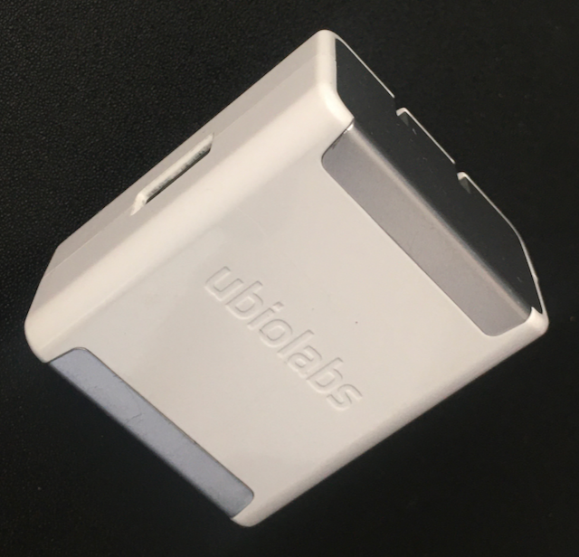
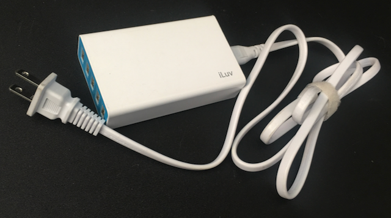

## The Question
Can a USB-C enabled iPad Pro charge at the old iPad charge rate over regular USB with an appropriate cable. I would call any DC voltage & amperage reading anything close to 5V 2.0 Amps (10 Watts) a yes.

The appropriate cable would be a USB A to USB-C cable, such that you could use an existing iPad or other high quality charger that supports up to the 5V 2.4 Amp USB charge standard. In this case only requiring you to buy a new cable if you don't already have one. I tried 2 cables one the Anker noted below, the other a generic no brand cable that I found in a drawer, both performed similarly, and the premium Anker Cable is rated to 5V 3 Amps, so it appears that the cables are not or should not be a limiting factor.

## The Results
The answer based on this experiment is No. A USB-C equipped iPad Pro can't take advantage of the maximum possible 5V 2.4Amp (12 Watt) classic charge standard. 

Results using USB A Chargers this is the peak rates I observed on the meter:
Charger | Volts DC | Amps | Watts |
---|---|---|---
Apple |   5.04| 1.41  | 7.10
iLuv   |  5.07 |1.41 | 7.14
ubiolabs | 5.08 |1.41  |7.16

The device appears to be limited to (7 Watts) while charging using a USB-A to USB-c cable, which is a little disappointing. 

The good news is that the iPad can still be charged using this cable, but useable as a slow trickle charge option, where you not in a hurry to charge your iPad.

## Equipment list for this experiment:

- iPad Pro 11" 3rd Gen with battery % between 40-80, just so we can see peak charge demand.

- [Anker USB to USB-C cable](https://www.amazon.com/gp/product/B07DC5PPFV/ref=ppx_yo_dt_b_search_asin_title?ie=UTF8&psc=1) Rated to 5V 3 Amp

- [MakerHawk USB Digital tester](https://www.amazon.com/gp/product/B07DCTG6LH/ref=ppx_yo_dt_b_search_asin_title?ie=UTF8&psc=1)

- Apple 10 Watt iPad Charger 5.1 V 2.1 Amp (10.7 Watt) 

- ubiolabs CHG1128AW 5V 2.4 Amp (12 Watt) 

- iLuv RockWall5 RockW5 5V 5Amp (only the iPad labeled port could deliver more than 5W) 

 

