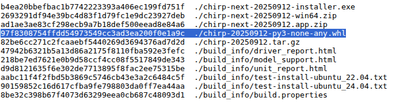

## Introduction 
This is a brief guide on how to install [CHIRP](https://chirpmyradio.com/projects/chirp/wiki/Home) on Linux Mint 21.x / 22.x. Since CHIRP's linux app is a python app it is a bit unusual in practice and when following the current instructions results in errors so in short this is what worked for me the last time I tried to install CHIRP.

## Installation with Errors

1. Start by visiting the [CHIRP Downloads page](https://chirpmyradio.com/projects/chirp/wiki/Download)

2. For Linux Mint 21.x - 22.x the correct variant of CHIRP is `CHIRP-next`, find the download link on the above-mentioned downloads  page. 

3. For Linux the file to download is named `chirp-YYYYMMDD-py3-none-any.whl` you may need to right-click and select "Save link as..." option to start the file download otherwise  the browser may load the binary file in the browser window if you click the link as named, if you see a page of strange text `PK����uI,[\Y½"��� ������chirp/__init__.pysöð`, this is what happened hit the back button in your browser and try the link again with right click option as mentioned above.

4. While here also click the `SHA1SUM` link by clicking on the link.  When the `.whl` finishes download run the following command and make sure that the hash output of the downloaded `.whl` file  matches the hash listed next to the `.whl` file in the SHA1SUM file.

    

```
sha1sum chirp-20250822-py3-none-any.whl
```

5. Since we are trying to install for Linux find the [details here link](https://chirpmyradio.com/projects/chirp/wiki/ChirpOnLinux) back on the [CHRIP Downloads Page](https://chirpmyradio.com/projects/chirp/wiki/Download#)

6. For Linux Mint run something like the following as the above link indicates 
```
sudo apt install python3-wxgtk4.0 pipx
```

7. Install CHIRP from the latest `.whl` file that was downloaded above 

```
pipx install --system-site-packages ./chirp-20250822-py3-none-any.whl
```

8. At this point I got an error something about "yattag package may not be installable in pipx" after taking a look at the [Troubleshooting](https://chirpmyradio.com/projects/chirp/wiki/ChirpOnLinux#Troubleshooting) I was able to find the command to fix my issue and that was the command as follows: 

```
sudo  apt-get install python3-yattag
```
9. Then I re-ran the following successfully.

```
pipx install --system-site-packages ./chirp-20250822-py3-none-any.whl
```

10. Finally, I was able to run CHIRP. 

```chirp```

11. When CHIRP first opens pay attention to the dialog that pops up and if you want to click the option in the dialog to allow CHIRP to create the program shortcut so it will have a launcher icon that you can search for to be able to start CHIRP without using the terminal command `chirp`.


# Conclusion 

CHIRP was not too difficult to install, but its linux program is a python app, and it did require some more work than most linux apps. This did take a lot of jumping around, debugging, and reading all the fine print to get it all sorted and successfully installed, hopefully these Notes will be helpful to get you through it faster.
