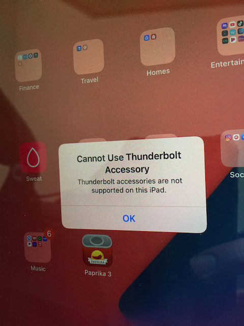

## Introduction

Recently picked up a Thunderbolt 3 dock and while waiting for cables and adapters to arrive to attach it to an old mac. I wanted to try and see what would happen if I plugged in an iPad Pro 3rd Gen 11", since that has Thunderbolt 3, and has a charging cable that should plug in, physically.

## Conclusion

In short, it did not work as a thunderbolt connection and was kind of expected, but it still can charge the iPad. No other functions worked.

iPad Pro comes with USB-C cable, which is not a thunderbolt cable and is only suitable for charging and usb data transfer.

## The Bad news

The iPad shows an utterly silly less than helpful error message, "Cannot Use Thunderbolt Accessory, Thunderbolt accessories are not supported on this iPad"

Why no I disagree, this iPad Pro does support Thunderbolt the specs says so, this is just another case of a poorly worded error message. So yes if you mix up your thunderbolt and usb-c cables be on the lookout for this misleading error. Your probably using the wrong cable.

Why Apple shows the above error instead of a something more sensible like  "Cannot Use Thunderbolt Accessory", "Thunderbolt accessory not supported with a USB cable." remains to be understood by me?
