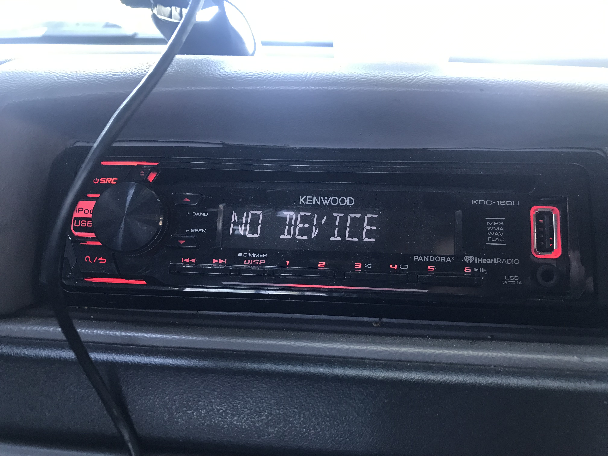

"CD Receiver with Front USB & AUX inputs
KDC-168U

(Discontinued)" - [KDC-168U | Receivers | Car Audio | Car Entertainment | KENWOOD USA](https://www.kenwood.com/usa/car/caraudio/receivers/kdc-168u/) 

[KDC-168 Manual - PDF](B5A-2441-00.pdf)

TODO Add links for offline and this link for features and specs and more from the kenwood site, files added here in GitHub

