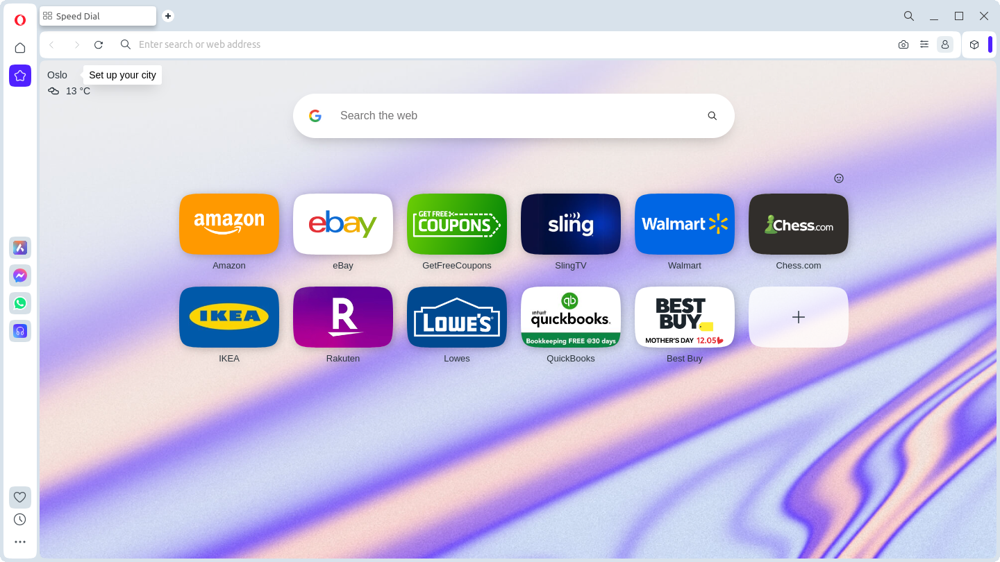

The landing page is a single page website dedicated to listing of all the sites you regularly visit sorted in order 
from most visited to least. 

## Does anyone still use bookmarks?

I do, and it has not really changed since the 1990s. Core problems are your bookmarks are limited to a drop-down menu 
or the bookmark toolbar or sidebar depending on your browser.

Just looking at the limited drop-down menu and folders to organize all and any bookmarks you want to keep, in general 
it's a lot of careful mousing and navigating to get where your going, no wonder googling has been the default to get 
there quick, and why the bookmarks toolbar and home buttons have been hidden by default in Chrome, Brave and other 
browsers.

I have been building a page for seeing bookmarks in a more full view as a side project for several years now. 
This full page view of all the websites you have saved sorted by most clicks at the top of the page.

Here is a proof of concept with sites I visit regularly.  If you would like to take a look at this live, try it now
[My personal Landing Page](https://ipfs.io/ipfs/bafybeiacqqyhof34mreni4sdf56nb6dgql24w34g3ovjm7t5ewpnd7ijku/).

## The Why

- This is something I came up with since I am tired of all my bookmarks I use 
just being in the limited space in the browser's toolbars and folders.

-  And I was tired of forgetting about a ton of interesting stuff hidden in never visited carefully categorized 
bookmark directory structures.

- Tired of having to rely on search engines to re-find things I already discovered.

- I was initially inspired by Opera's Speed 
Dial  

- And also inspired by just viewing my bookmarks exported as html from most browers. If you open the file in your 
browser, you get a page that looks something like this 
 

## The planned and proposed workflow:
1. Import your bookmarks.html, all get added into a giant list on the landing page or add your sites you visit one at 
a time. 
2. click the link to load the page you want or use the search to narrow down the results on your landing page.
3. Find the link and click it, the webapp maintains in browser a click count for each site you click on.
   The landing page is sorted by most clicked bookmarks near the top, stuff rarely visited is at the bottom of the page.
4. When a match is not found, it will do a search and open in a new tab your search results

## The source code

The source code for where I am currently at is here https://github.com/djbrieck/landingPage/tree/landing-page-angular.

The Original Design is on the main branch still, this is a simple HTML page only.

This one is like an improved bookmarks export list adding the feature of having a large clickable area for each link 
rather than having only the narrow target of the link text itself.
[Landing page first mockup live link](https://ipfs.io/ipfs/bafybeigqbwl2qwlerb2nwde4uund43xggfwf5dzkm2e5ekyycmgzjcth44/)

Trying out a mockup in Angular since I may need some of the features built into Angular.

[Angular first attempt static Live](https://ipfs.io/ipfs/bafybeibgq2zpgroyo6lu5bo6ri77o4455gzaqry4z3uzw2chkyal3kia3m/)

[Angular next attempt static]() ipfs://bafybeidnalp55sxv543jmzw5kml6akfa4lpy6iectq27tzimy5nhjnefri/

Angular update 10/8/2023 QmSqb5R7zQXvNk55tnqTyyioANq39djUQvd9fb8KtVE1TM

## The Future and features to add

The next step is implementing a dynamic UI that renders the list via a angular service, so that I provide json, api, etc and it shows the list of bookmarks based on that

Next would be implement local storage

Add in adding of bookmarks

Add in edit bookmarks

Add  removing of bookmarks.

Add in import bookmarks

Add in export bookmarks

