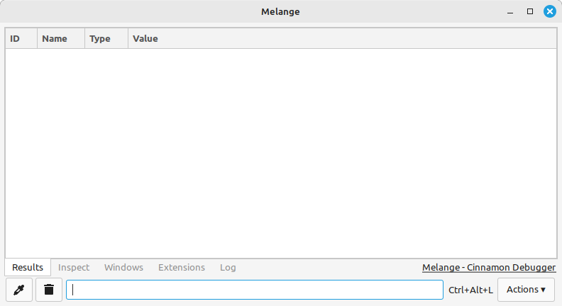
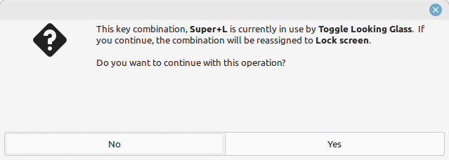
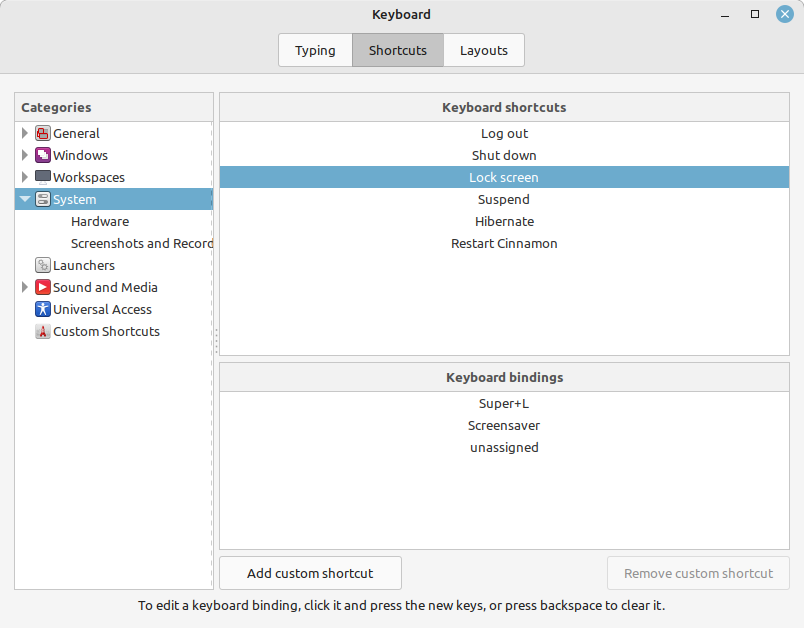
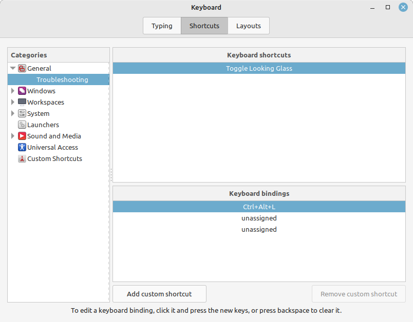

This is for you If you try to lock your screen like you do on most PC's and instead are greeted with a surprising new 
window titled `Melange`.

This is a guide on how to swap or fix the screen lock shortcut so that it's <kbd>Win/Super</kbd> + <kbd>L</kbd> instead of 
Linux Mint default of <kbd>CTRL</kbd> + <kbd>ALT</kbd> + <kbd>L</kbd> to lock the screen.

Relevant for Debian, Linux Mint and possibly more Cinnamon-based UI Linux distributions.

## Swapping Lockscreen and Melange (looking glass) default keyboard shortcuts 

### Setting  <kbd>super</kbd> + <kbd>L</kbd> to Lock Screen

1. Open `Menu` type in `keyboard` select program 'Keyboard'

2. Click `Shortcuts` tab

3. Under categories click "System" or if there is a filter box type in `lock`

4. Click on "Lock screen"

5. Click the current keyboard keys assignment to replace it.

6. Press the keys <kbd>super</kbd> + <kbd>L</kbd>

7. Pop up will show "This key combination,
<kbd>Super</kbd> + <kbd>L</kbd> is currently in use by Toggle Looking Glass ..."
Press `Yes` to reassign

    

    

### Optional reassign Looking glass shortcut to  <kbd>Ctrl</kbd> + <kbd>Alt</kbd> + <kbd>L</kbd>

8. Then find under categories General > Troubleshooting.

9. Find the keyboard shortcut "Toggle Looking Glass"

10. Then reassign by clicking the unassigned first line and then press keys <kbd>Ctrl</kbd> + <kbd>Alt</kbd> + <kbd>L</kbd>

