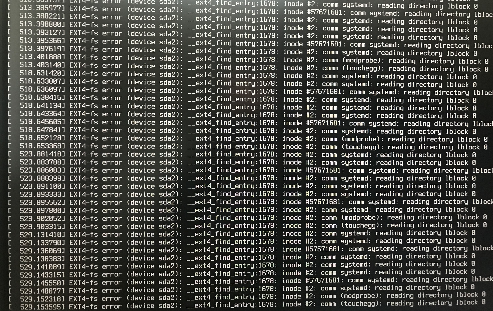

## The problem 
I have stalled not fully starting  Mac Pro 3,1 after re-installing its SSD hard drive. 

Upon reinstalling the SSD back into the Mac Pro the machine just hung on LM logo never booted any further. Recalling I 
should be able to switch to a console output for booting with the chance of seeing any potential errors. I researched 
and rediscovered <kbd>ctrl</kbd> + <kbd>ALT</kbd> + Choose one at a time <kbd>F1</kbd> through <kbd>F7</kbd> to switch 
between consoles and [GUI](https://en.wikipedia.org/wiki/Graphical_user_interface).

After switching to the `F1` console output I was seeing a wall of errors as pictured.

In short was getting at a lot of errors reading the file system like the following: 
`... EXT4-fs error (device sda2): __ext4_find_entry:1670: inode #2 ...`

I restarted the system, and it was just going straight to a https://wiki.ubuntu.com/Initramfs prompt and not doing 
anything useful, so something was up.

## Here is how I fixed it

1. I plugged in my Linux Mint 21.1 USB bootable Live installer and rebooted the system running from the USB Stick.
2. I Opened the [Disks](https://apps.gnome.org/DiskUtility/) program by searching in the Linux Mint Menu.
3. I located and selected the internal SSD from the list of installed disks
4. Clicked the gear ring and selected `Repair Filesystem...` for each partition on the boot and primary SSD.

When the repairs were completed, I restarted and removed the bootable USB drive.  The Mac Pro was booting again, and all 
was working as it should be.