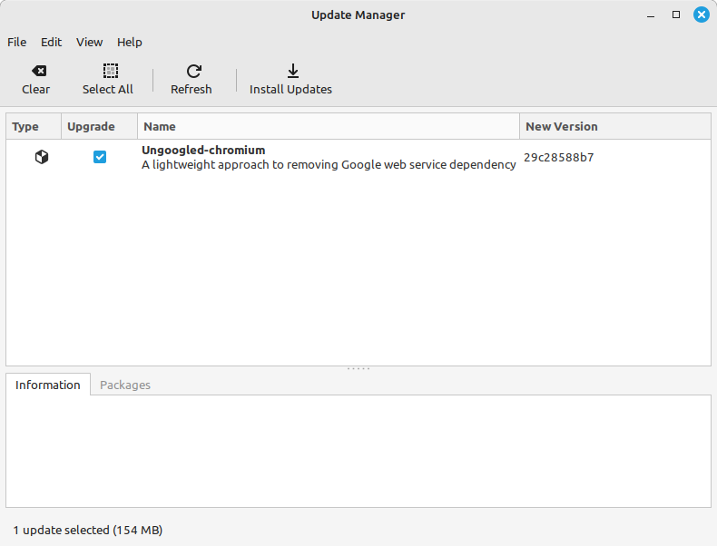

## The Problem:

I have an update that Update Manager just will not install  Ungoogled-chromium version 29c28588b7 . I can click refresh 
and install updates. However, Nothing happens on trying to install just the package Ungoogled-chromium  e.g. no prompt 
for password no indication of any kind of problem.  A handful of other updates I was able to install this morning normally, but this one 
just will not install. Was running Linux Mint 21.3 Cinnamon (6.0.4) and 5.15.0-105-generic on x86_64 system.

## The Cause

The installed Ungoogled-chromium version 29c28588b7 has been marked as end-of-life in Flatpak, and Software Manager is 
giving no indication of what going wrong besides the update not installing.

## The fix:

1. Recognize from the window that this stuck package is a Flatpak package, hint it's the Type column and the cube icon.
2. open the Terminal program.
3. Run `flatpak update` as can be viewed in the output below. It appears the installed Ungoogled-chromium flatpak 
package was marked as end-of-life and has been replaced by something at a new GitHub path. 

 Here is a brief summary of the changes that occurred: `com.github.Eloston.UngoogledChromium` (old) vs `io.github.ungoogled_software.ungoogled_chromium` (new)

       daniel@Lili-Linux:~$ flatpak update
       Looking for updates…
       Info: (pinned) org.freedesktop.Platform.VAAPI.Intel//21.08 is end-of-life, with reason:
       org.freedesktop.Platform 21.08 is no longer receiving fixes and security updates. Please update to a supported runtime version.
       Info: (pinned) org.freedesktop.Platform.GL.default//21.08 is end-of-life, with reason:
       org.freedesktop.Platform 21.08 is no longer receiving fixes and security updates. Please update to a supported runtime version.
       Info: com.github.Eloston.UngoogledChromium.Locale//stable is end-of-life, in favor of runtime/io.github.ungoogled_software.ungoogled_chromium.Locale/x86_64/stable
       Replace it with runtime/io.github.ungoogled_software.ungoogled_chromium.Locale/x86_64/stable? [Y/n]: Y
       Info: com.github.Eloston.UngoogledChromium.Codecs//stable is end-of-life, in favor of runtime/io.github.ungoogled_software.ungoogled_chromium.Codecs/x86_64/stable
       Replace it with runtime/io.github.ungoogled_software.ungoogled_chromium.Codecs/x86_64/stable? [Y/n]: Y
       Info: com.github.Eloston.UngoogledChromium//stable is end-of-life, in favor of app/io.github.ungoogled_software.ungoogled_chromium/x86_64/stable
       Replace it with app/io.github.ungoogled_software.ungoogled_chromium/x86_64/stable? [Y/n]: Y
    
       io.github.ungoogled_software.ungoogled_chromium permissions:
       ipc              network          cups               pcsc
       pulseaudio       wayland          x11                devices
       file access [1]  dbus access [2]  bus ownership [3]  system dbus access [4]
    
       [1] /run/.heim_org.h5l.kcm-socket, home
       [2] com.canonical.AppMenu.Registrar, org.freedesktop.FileManager1,
       org.freedesktop.Notifications, org.freedesktop.ScreenSaver,
       org.freedesktop.secrets, org.gnome.SessionManager, org.kde.kwalletd5,
       org.kde.kwalletd6
           ID                                                                       Branch              Op              Remote              Download
          1. [-] com.github.Eloston.UngoogledChromium                                stable              r
          2. [-] com.github.Eloston.UngoogledChromium.Codecs                         stable              r
          3. [-] com.github.Eloston.UngoogledChromium.Locale                         stable              r
          4. [✓] io.github.ungoogled_software.ungoogled_chromium.Codecs              stable              i               flathub             992.5 kB / 991.6 kB
          5. [✓] io.github.ungoogled_software.ungoogled_chromium.Locale              stable              i               flathub             184.5 kB / 184.7 kB
          6. [✓] io.github.ungoogled_software.ungoogled_chromium                     stable              i               flathub             147.6 MB / 153.1 MB
    
       Changes complete.
