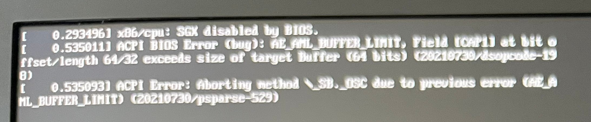

I have been running Linux Mint for years and often see various error messages printing on the screen while booting up Linux Mint 21.x. They don't seem to be major issues since the system keeps booting and has been running "well" for years. Curious if I wanted to dig into what the actual issues are, how would I see them short of snapping a picture with my phone, which I managed to do but at just 1-2 seconds to capture this it's hard to capture a clear photo and near impossible to try and read it without taking a photo, however it seems after doing some research it appears you don't have to take a picture to see this everytime.

    dmesg --level=err

Here is the output from the above pictured system. and as we can compare it matches what was flashed on the screen and also appears to show one more that was not displayed on the boot screen.

    daniel@Lili-Linux:~$ dmesg --level=err
    [    0.293496] x86/cpu: SGX disabled by BIOS.
    [    0.535011] ACPI BIOS Error (bug): AE_AML_BUFFER_LIMIT, Field [CAP1] at bit offset/length 64/32 exceeds size of target Buffer (64 bits) (20210730/dsopcode-198)
    [    0.535093] ACPI Error: Aborting method \_SB._OSC due to previous error (AE_AML_BUFFER_LIMIT) (20210730/psparse-529)
    [    6.846875] snd_hda_codec_conexant hdaudioC0D0: vmaster hook already present before cdev!

## References
[Linux Mint Forms - How do I read the error message at login](https://forums.linuxmint.com/viewtopic.php?t=334007)

[dmesg - Wikipedia](https://en.wikipedia.org/wiki/Dmesg)

[dmesg - Debian manpages](https://manpages.debian.org/bookworm/util-linux/dmesg.1.en.html)

[Linux Mint](https://linuxmint.com/)
