## Introduction

Learned something new you can connect to Wi-Fi using a QR code, this QR code is easily accessible in Android for sharing from the Wi-Fi Settings, but a bit of a challenge on iPhone / iPad, but can  be accomplished.

Seeing how it's done on Android [Sharing and connecting with QR code on Android](https://odysee.com/@ion:d/how-to-share-wifi-password-with-qr-code:c)

To be able to generate a QR code on Apple devices you will need the [Apple Shortcuts](https://apps.apple.com/us/app/shortcuts/id915249334) app installed.

## Generating a QR code for connecting to Wi-Fi

1. Open the Shortcuts App  

    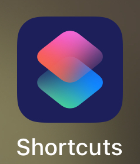

2. Find and touch the "Gallery" icon

   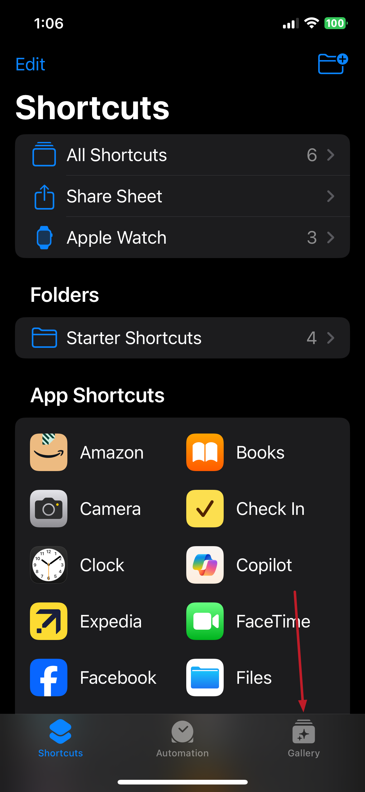

3. Find and touch the Shortcuts for Accessibility section

   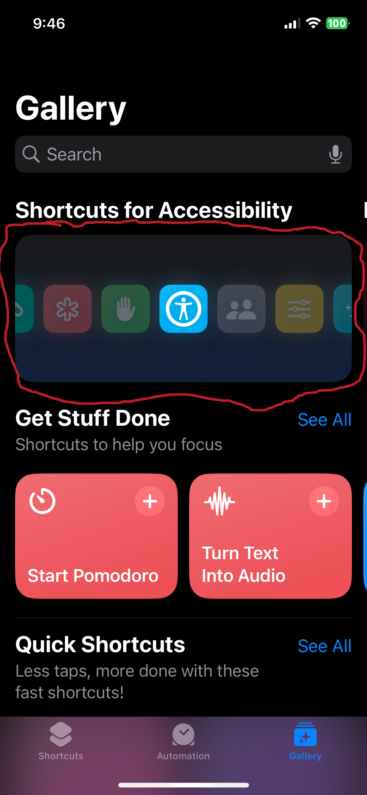

4. Look through the Access Tools and find the "QR Your Wi-Fi" shortcut, you may have to swipe left or right to find it as indicated in red.

   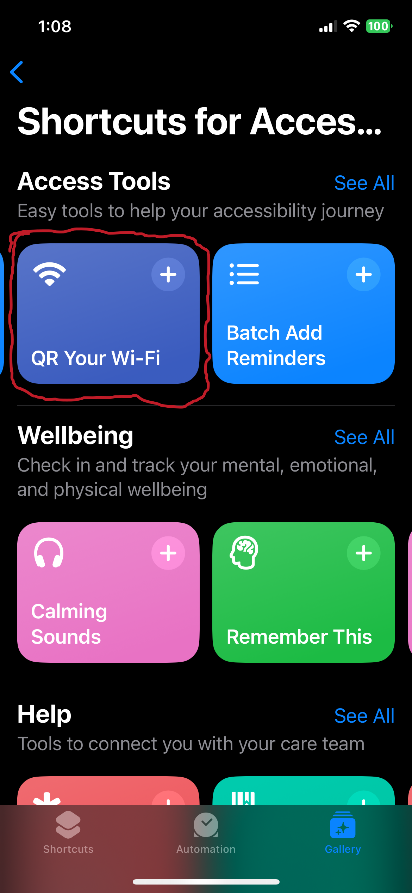

5. Then tap the "+ Add Shortcut" button

   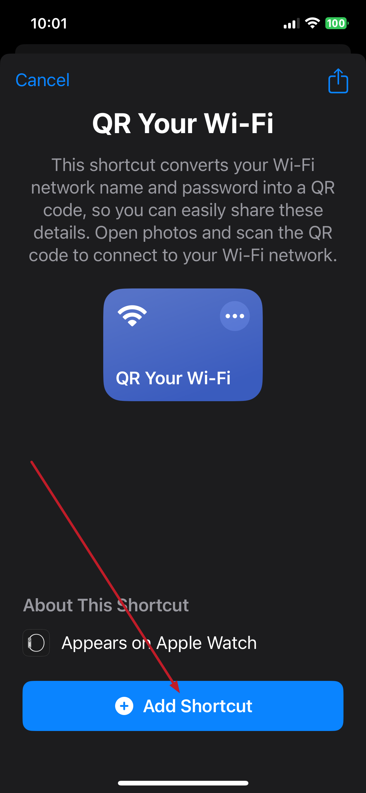

6. Tap the shortcuts button at the bottom, then tap "All Shortcuts" at the top.

   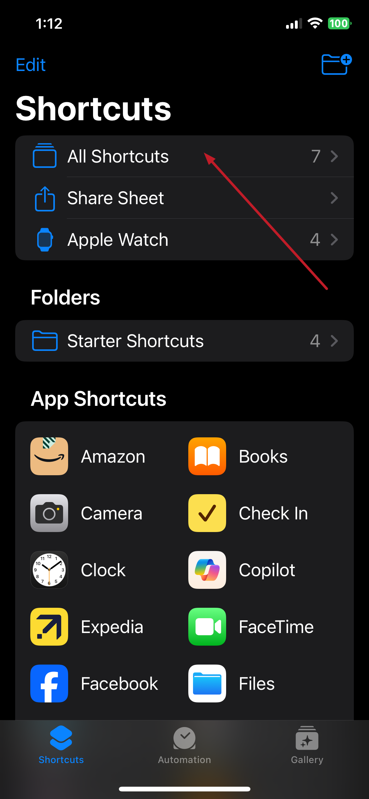

7. Tap "QR your Wi-Fi"

   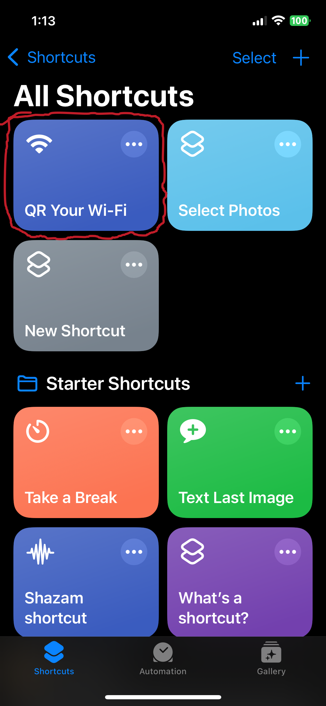

8. Enter Wi-Fi name it should show by default the one you are connected to.

   In this example I entered `MeeHomeWifi`

   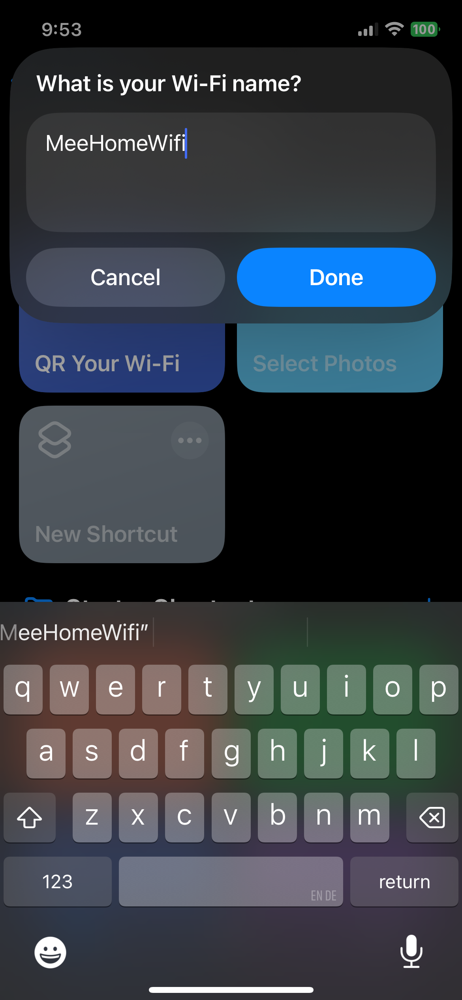

9. Enter the Wi-Fi password carefully you must get this right for the QR to work.
   In this example I am entering `yLTnxcrPnEWCM0LWoFBv`

   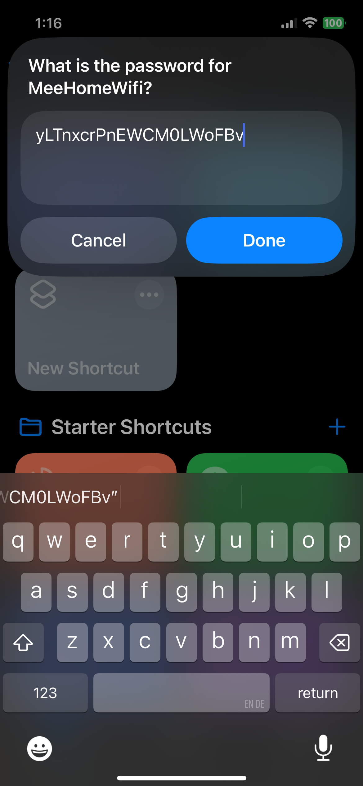

10. QR code is generated and displayed on the screen.

   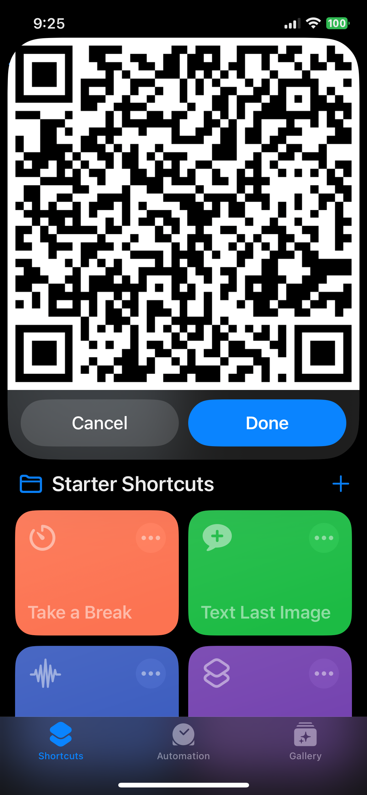

11. Tap the QR code once It will show full screen. 

12. Then tap the QR once more and tap the Share icon where you can Save Image or Save to Files, etc. Since if you press cancel or Done in Shortcuts the QR will be gone, and you will have to redo steps 6-9 to get the QR back again.

   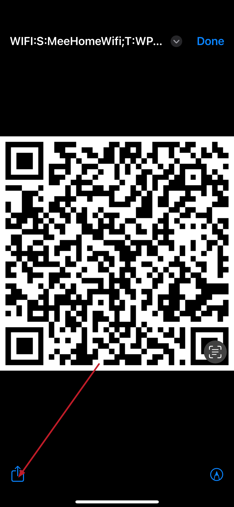

13. The saved QR Image Example as generated here.
    Feel free to use this QR to test, fear not this is not an actual Wi-Fi network I use.

   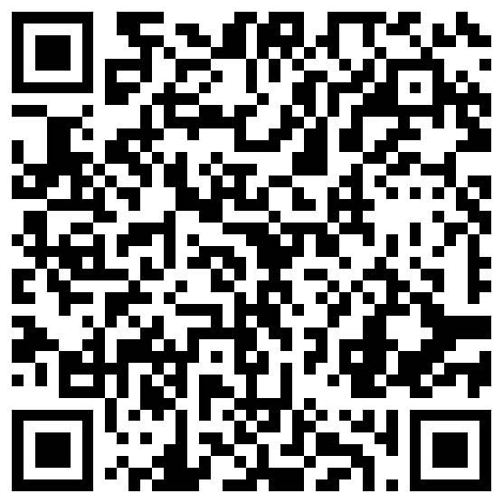

   SSID:`MeeHomeWifi`
   Password:`yLTnxcrPnEWCM0LWoFBv`

   RAW QR text this is what your devices reads to be able to connect to Wi-Fi:  
`WIFI:S:MeeHomeWifi;T:WPA;P:yLTnxcrPnEWCM0LWoFBv;;` courtesy of [ScanQR.org](https://scanqr.org/)

## Connecting to Wi-Fi with a QR from an Apple iPad or iPhone.

   Follow the steps on my other post for [How to connect to Wifi using a QR code on Apple Devices]()

## Some references 

[OSXDaily - How to Share a Wi-Fi Password with QR Code from iPhone or iPad](https://osxdaily.com/2021/07/08/how-share-wi-fi-password-qr-code-shortcuts/)

[Asurion - How to share your home network info with a QR code](https://www.asurion.com/connect/tech-tips/how-to-share-home-network-info-with-qr-code/)