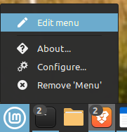
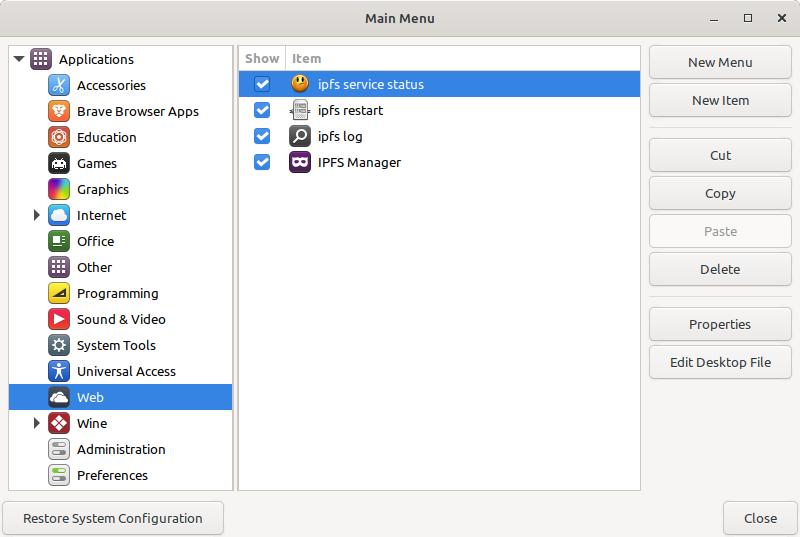
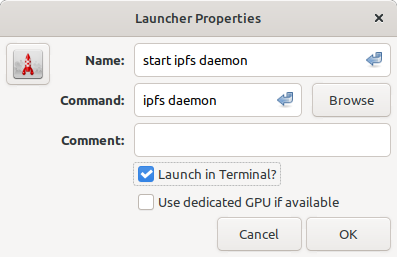
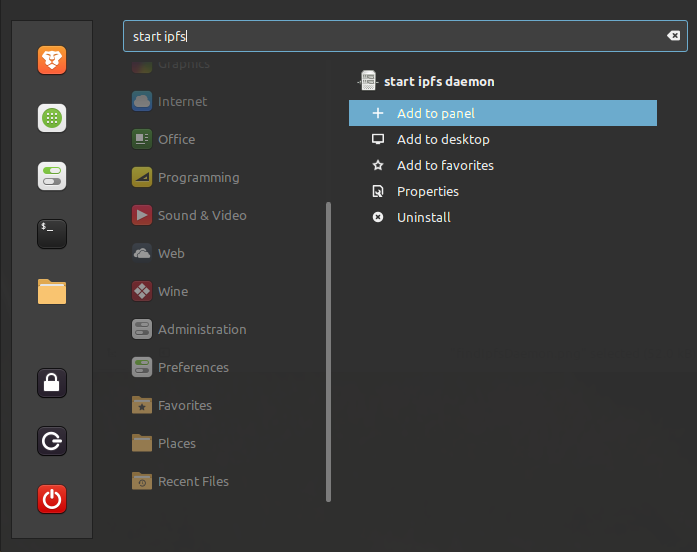
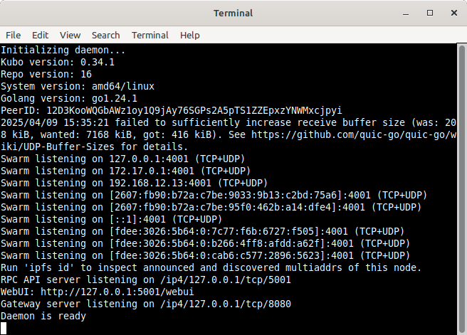

## Introduction

The goal here is to have an app launcher icon than can be placed in the menu / taskbar on Linux mint to start the ipfs daemon and leave a terminal window open.

This is an alternative to doing this manually or setting up a system service to start and stop manually.

With the following workflow goals of having an icon in task bar when clicked does the following. Opens terminal and runs the ipfs daemon command and leaves the window showing.

## Here are the steps to create a one-click start for the IPFS daemon on Linux Mint Cinnamon:

1. Right-Click on the Cinnamon Menu

    

2. Select "Edit Menu"

3. I selected "Web" Applications category.

   

4. Click the "New Item" button

   

5. For Name: enter `start ipfs daemon`

6.  Command: `ipfs daemon`

7. Check checkbox for "Launch in Terminal ?"

8. Pick a different icon if you wish. Click the red rocket icon to bring up the `Choose an icon` window. Press the `Select` button when done.

9. Click "OK" when done

10. Search for the item in Menu

11. Right click on `start ipfs daemon` and select Add to panel.

   

12. Now its in the menu bar, and you can click and start ipfs with just one click.

    

13. The Terminal window stays open until you stop server using <kbd>ctrl</kbd> + <kbd>C</kbd>or close the window stopping the server as well.

   

## Conclusion 

With these steps you can easily start the IPFS daemon with a single click from the taskbar in Linux Mint Cinnamon. This can streamline your workflow and make it more convenient to manage your IPFS node. Enjoy using IPFS!