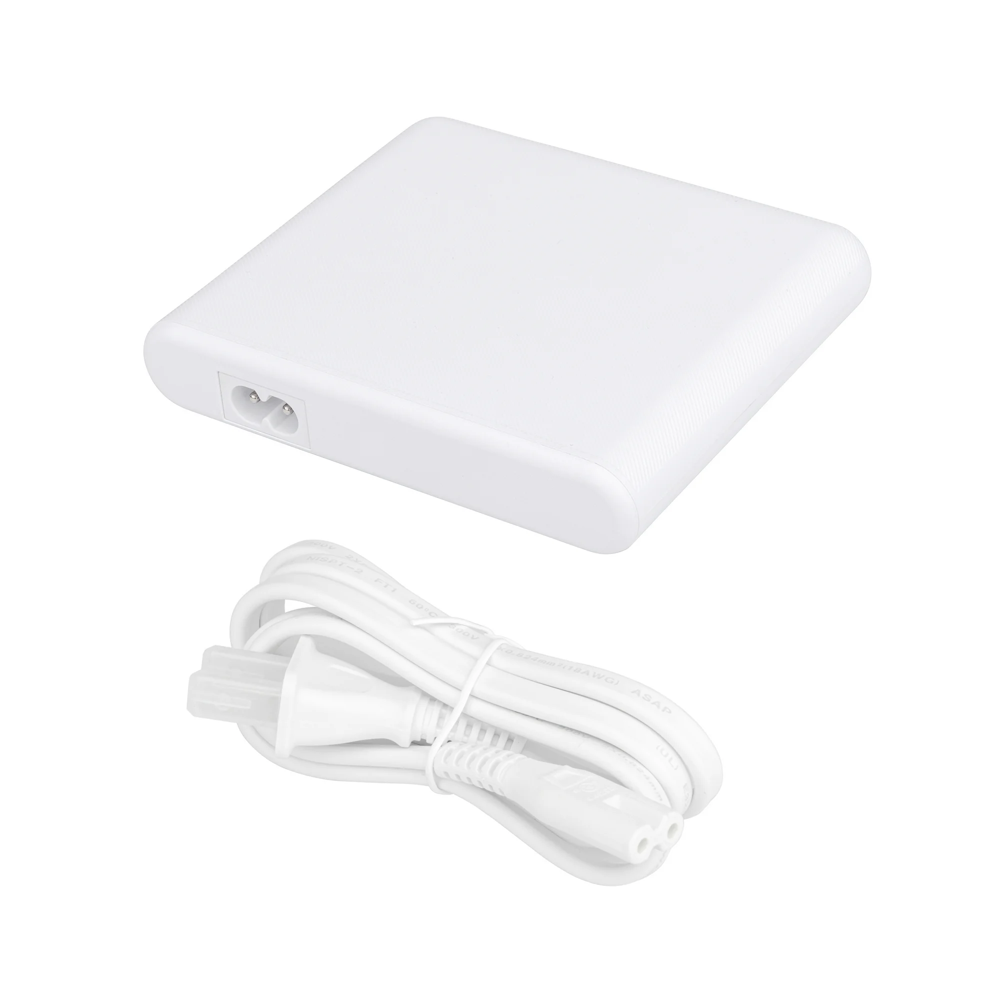
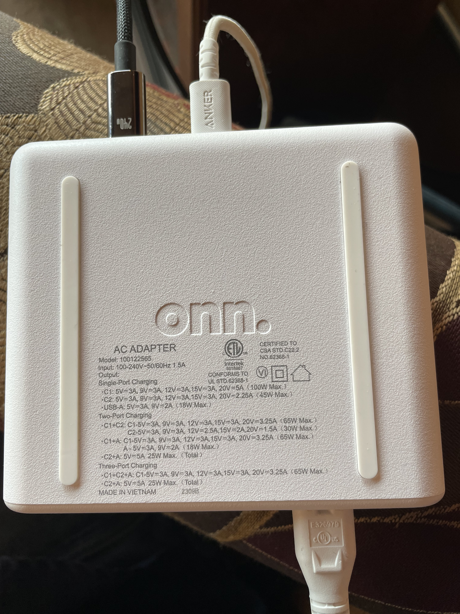

## Introduction 
Picked up this at Walmart in the clearance section for about $15 which is a great one time deal, a charger of this caliber would be in the $40-$50 at normal retail rates. This was quite the deal, and is a really decent charger for home or travel use. 

## Review 
This so far has been a fantastic charger works great for running my Laptop, phone and Tablet. And I was able to replace my laptop AC adapter brick and separate USB charging block all in one device and saved me 0.5oz in weight in my backpack. I really like the integrated cord which is very handy since most usb-C chargers are a block that plugs directly in an outlet. Plugging into an out let directly does have some downsides. For example, not begin able to plug in with other things plugged in, not fitting in narrow places behind furniture. I am guessing if you have such a block a basic extension cord would be a must-have. With this device you can leave the extension cord at home and gain some more weight savings, since in most cases an outlet is usually within 6 feet away. This device is probably meant to be left on a desk but in practice it works well for travel use so far, very well-built and has solid high quality feel to it. I know the branding calls this a Charging Station, but for me, I call it a charging hub since it looks like a USB hub.

I have been using this charging hub daily since September 13, 2024. In general, it works great, does not get too hot. The largest downside and annoyance with this charger is its fix allocation method. This thing does leave some capacity on the table depending on what and how you plug in things. For example my laptop typically uses only 7-20  watts of power (with regular non charging usage) but with this charger it is always allocated a full 65 Watts of the 100 watt capacity even if it rarely uses that much.

## Downsides fixed allocation and interruptions

This charger does interrupt charging for all attached devices when anything is plugged in or removed. If you have a 65 watt or less laptop this device does work well always allocating 65 for it no matter what is plugged in, but depending on what is plugged in you may not get enough juice to charger it all at its fastest rate.

### One Device max power at 100 Watts
If you really need the full 100 Watts then this charger can only be used with the one laptop port occupied.

### Two Devices using USB-C ports is Best
Two device charging using both USB-C ports is best for this device when using both usb-c ports with a fix allocation of 65Watts and 30 watts delivering nearly 95 Watts of the rated capacity of 100 Watts

### Three devices works well and replaces legacy dual usb charger well
Three Device charging is less ideal with both non laptop marked ports being locked to 5V 5A charging shared between the two ports, which could be inadequates for charging and using multiple modern tablets / devices expecting power delivery charging to work optimally. Since higher than 5V Power delivery charging is disabled in this configuration for everything but the first device and total output of the charger is capped at 90 Watts 65Watts for the USB-C 1 port and 25 Watts for both USB-C 2 and the USB A port. In this case the later two ports still exceeds the capacity of my legacy Anker dual usb charger at 5V 4.8Amps, so it's not really a step backwards, but as we go forward in time it seems fewer device can take full advantage of the legacy 5V 2-2.5Amp charging standards.  It seems most modern devices will unfortunate cap out at 5V 1.5 Amps in practice when charging in a legacy 5V mode, which may leave 10 Watts capacity un usable on newer higher end devices, Like iPhones, iPads, Google Devices, etc. 

## Conclusion

This is a decent charger and does its job quite well, wish it was available for purchase all the time, unfortunately the deal I got was a one time one, and as of writing this post, its no longer available on Walmart.com for order new for around $30. The power output and value is quite good for this charger, Looks around at what you can get anywhere close to the price range, hard to find 65Watt laptop output and 2 other ports with standard legacy power (around 5V 2A output each). So for now the only thing that even comes close to this charger in price and features is the [Amazon Basics 100 Watt charger](https://www.amazon.com/AmazonBasics-Four-Port-Charger-USB-C-Ports/dp/B087MDYP24) and a 6+ foot extension cord, which will cost you quite a bit more than $15 - $30

## Below is the original marketing info and photos from Walmart.com.

    Power at the ready! We've taken the hassle out of charging. Our onn. Multi-Port Charging Station packs a punch – it's a 3-in-1 charger with 1 USB and 2 USB-C ports delivering 100W of power! It plugs directly into a wall socket so you don't have to mess with any extra chargers, and you can have a dedicated power station at the ready. Surf onn.™ We're onn. to something here. We took the hassle out of buying electronics and built a brand that's fresh and simple. With delightful pops of color, finding the right product has never been easier. Say goodbye to stressful decision-making and fear of the electronics aisle. Our mission is simple... to deliver great products and make it easy. Choose onn.™ and get back to using your brainpower for the important things in life.. like pondering the question, "What should I binge watch this weekend?"
    100W Multi-Port Charging Station 3-in-1 Charger, White,
    Over-current/heat and short-circuit protection
    Uses GaN Technology for more effciency in a smaller package
    LED Power Indicator
    Works with most USB-C® charged devices including Apple, Dell, HP, Asus, Acer, Lenovo, onn™., Samsung, Sony and Toshiba
    
    Input: AC 100-240V (50/60Hz)
## Fixed Charging Modes supported
    Output: Single-Port Charging–
    USB-C1: DC 5V/3A, 9V/3A, 12V/3A, 15V/3A, 20V/5A (100W Max)
    USB-C2: DC 5V/3A, 9V/3A, 12V/3A, 15V/3A, 20V/2.25A (45W Max)
    USB-A: DC 5V/3A, 9V/2A (18W Max)
    
    Output: Two-Port Charging–
    USB-C1 + USB-C2: 65W Max + 30W Max
    USB-C1 + USB: 65W Max + 18W Max
    USB-C2 + USB: 25W Max (Shared)
    
    Output: Three-Port Charging–
    USB-C1 + USB-C2 + USB: 65W Max + 25W Max (Shared)

## Underside and regulatory markings on the actual charger not pictured in the Stock Photos 

The source for the above stock text and images as quoted from [Walmart - onn. 100W Multi-Port Charging Station 3-in-1 Charger, for Laptop and iPhone, White](https://www.walmart.com/ip/onn-100W-Multi-Port-Charging-Station-3-in-1-Charger-for-Laptop-and-iPhone-White/1769453001?from=/search)