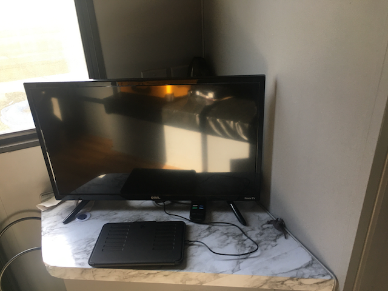
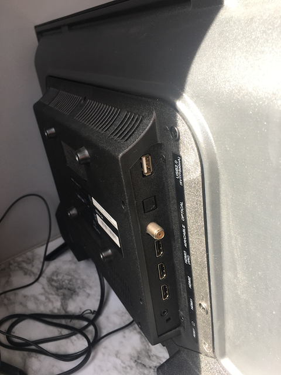
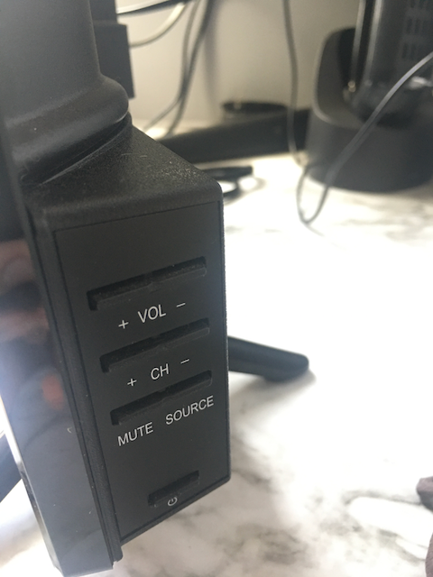
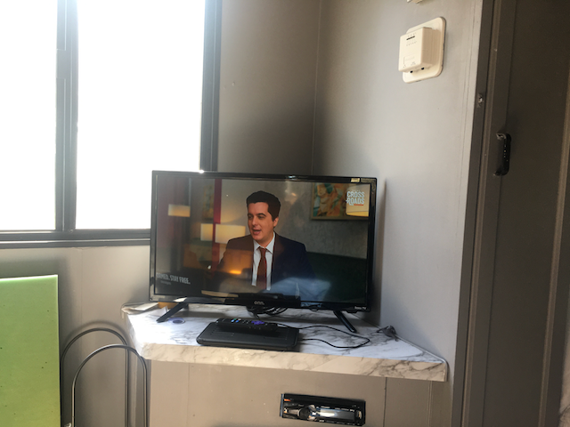

Purchased this TV for use in a RV, its a little expensive for what it is at around $130 USD, but it has plenty of inputs and works well for a small TV thats needed in a small space. 

## Connectivity

USB port for powering Streaming Sticks or charging USB things at  500 mA worth of power.

3 HDMI inputs one with ARC, for connecting a soundbar or other compatible audio system.

Coax Tuner connection 

Component Video is pretty nice, and makes this a great display for connecting legacy gaming consoles and such.

Optical Audio out for connecting a sound-bar / audio system.

Headphone jack.

VESA wall mount ready with 100mm x 100mm holes present.

## Usability

The ROKU part is fantastic and works well like any Roku device. Nice simple and reliable UI, the thing just works and is easy to use.

Does have more than one button interface, which is very nice, lots of TVs lack this many buttons. Power button, Volume up and down, channel up and down, mute and source selector buttons. That all you can do, everything else must be done using the TV Remote. 

## Remote

Same good Roku remote that comes with all Roku TVs. Once you learn how it works, it works the same across all your TV's which is quite fantastic when compared to the foot long remotes of the past with dozens of useless buttons that are hard to understand and use.

## Sound 

Sounds gets plenty loud, has no base, everything sounds flat. system is loud enough to be useable over a loud RV propane furnace.

Headphone jack is included and you can control the volume level with the TV remote or volume buttons on right side of the TV .

## Video

Classic 720P res, which I am surprised to see in a new TV purchased in 2021, but it does  upscale to 1080P/i. And at 24" you really can't tell a difference when using as you would a TV. 

Even with a low 720P resolution movies and videos look great on this TV, you will not notice its not Full HD.

Oddly enough this works as a computer monitor at 1080i, yes thats right 1080i/P. And just to be clear thats simulated 1920 x 1080P on a 1280 x 800 Screen. Both 1080i and 1080p are options when connecting to a Mac over HDMI. 1080i looks less burry. Text is a little blurry but its useable in a pinch quite surprisingly, kind of blown away it works at all, since showing more pixes than exists in the screen is kind of mind blowing that it works at all.

Definitely does not get bright enough, you must use in a well shaded area, bright sunlight rooms will easily drown out the dim backlight.  For example I was using this as a monitor and sun coming thru a near by window and reflecting off of me or table or anything as just making the screen un viewable.

Also the screen is glossy so if there is lots of light in the room in can be quite distracting. So stay out of the spot light if your trying to use this TV.

## Conclusion 

This onn tv is great for a small space, or any special use case, where a TV this small is needed, otherwise this tv does not make a lot sense to buy. For a little more money you can get a better 27" or 30" 1080P TV, so unless you have a specific use case, eg in a RV or other small place where larger TV's just won't fit, this TV should not be your first pick.