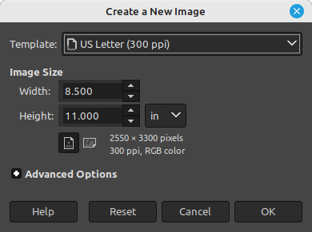

This is for those times when you can't find the coloring page your looking for but can find plenty of photos or already colored drawings. This process will turn a photo into a line drawing.

For this one you will need to have [GIMP - GNU Image Manipulation Program](https://www.gimp.org/downloads/) installed on your computer.

1. Open Gimp.
2. File > New
3. Select Template aka paper size you will be printing on. 
   
   

4. Select orientation Portrait or Landscape depending on the orientation of the source image.
5. File > Open Image as Layers and open the image you want to convert.
6. Select Move Tool 
7. Resize the image and make it as large as will fit. Press Shift + S to enable the grab corners to do so
8.  Select Colors > Desaturate > Desaturate...
9.  Press OK
10. Filters > Edge-Detect > Edge...
11. Press OK
12. Color > Invert
13. Save or Print the line drawing creation.

## TODO Add / make a screen recording doing this process

## Add link to video on whatever, and add converted file here for downloading

## Add the orginal picture

## add a converted one

## Add the GNU file created

Source 

[Making a line drawing from a photo](https://www.reddit.com/r/GIMP/comments/edjrzn/making_a_line_drawing_from_a_photo/)