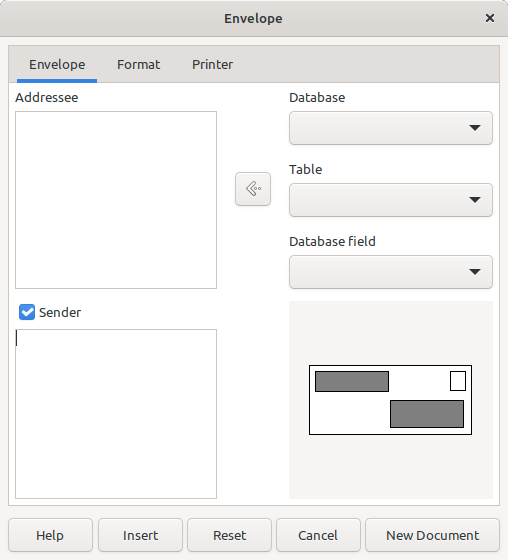
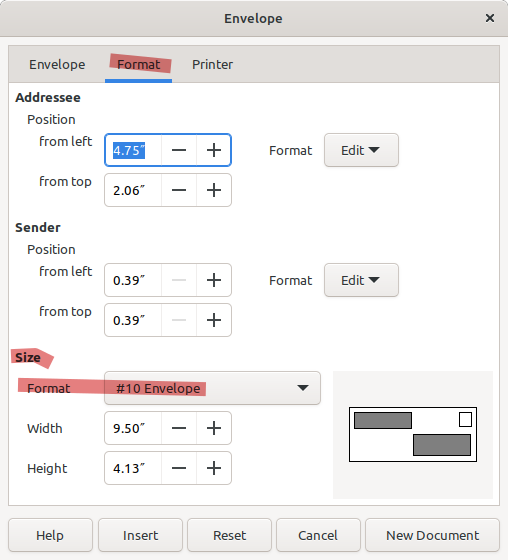

Don't handwrite those return and to address on your repeating bill envelopes. Print them right on your own envelops using [LibreOffice](https://www.libreoffice.org/).

1. Open LibreOffice Writer

2. Click on Insert drop down menu and choose "Envelope..."

3. Fill in the Addressee and Sender details, click the Envelope Tab if It's not already selected.

4. Click Format tab and under the 'Size' subsection select the envelope size from the Format Drop down.

4. When finished making changes for formatting and printer click the "New Document" button.

5. Save you letter template so you can open and reuse.

6. Now Print File > Print or <kbd>control</kbd>-<kbd>P</kbd>, this may take some trial and error to get the orientation correct for the printer you are using.

## Resources

[Download / Get LibreOffice for Linux, Windows and macOS](https://www.libreoffice.org/download/download-libreoffice/)

