## Backstory

I was looking for a newer computer to replace the aging [Apple Mac Pro 3,1](https://lowendmac.com/2008/mac-pro-early-2008/). I was running into several issues that made it clear it was time to move off of this computer as my full time computer.

- The loud fan  with the ATI Radeon HD 5770 GPU . Everything worked well enough it was just that  the GPU blower fan is out of control when running any kind of current open source driver with constant cycling noise as the fan changed RPMs for almost every graphical action.  AMD had dropped driver support and only opensource drivers are available for the ATI Radeon HD 5770. I was on Linux Mint 21.x at the time. 

- High power consumption was a bit out of hand as well, at nearly 300 watts idle for the entire Mac Pro, which is about what our space heater draws on low power, and for a system that's on 24/7 it was a bit much.

- Ram was lacking too I had 16GB and a couple of modules had failed leaving with me only 12GB of ram. And RAM since it requires ECC and special heat sinks is not cheap for this system.

- Limited GPU upgrade options if I want to see a boot screen, which I do want, LOL. Also, my best upgrade option for my use case is an Nvidia Quadro K5000 Mac Edition or  Mac EFI flashed PC Quadro K5000 card, but either way it makes a $50 GPU now cost $120 or more. I do want to maintain native compatibility with MAc Os 10.11 as installed on this system. Since I have no interest in installing any newer macOS  on it. Also since it seems like no one is running this K5000 card on this Mac with a modern linux I have no guarantee if it will work any better than the HD 5770 does when running Linux in terms of fan noise. 

## Finding a better solution

I started looking for something else and started looking at used computer systems for sale on [eBay](https://www.ebay.com). Initially I was looking at old Dell, HP and Lenovo workstations. Then I discovered CPU Mother board Combos and custom PC builds as well.  And I managed to spot this one computer for sale under a brand of  [Velocity Micro](https://velocitymicro.com/). 
    
   

I had never heard of the [Velocity Micro](https://velocitymicro.com/) custom PC building brand before. I did catch the case, which looked very much like a Lian Li aluminum case of yore that I always liked the looks of. So after reviewing the Specs it was quite a deal and even a decent performance upgrade over my current Apple 2008 Mac Pro 3,1 dual quad.  

The selling points for me:

   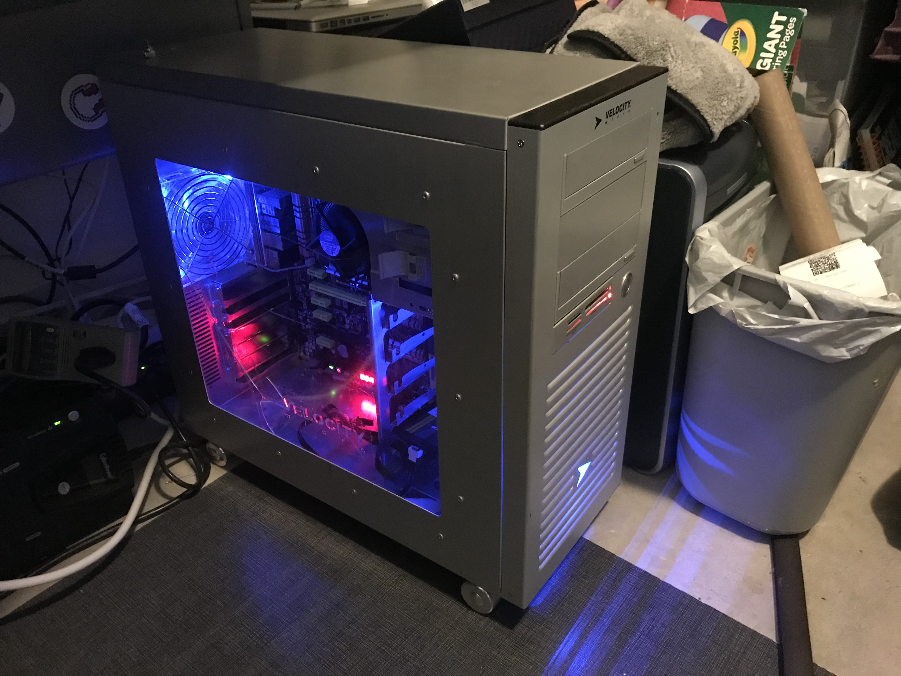

-  Lian Li case with room for many drives including three 5.25" bays, five 3.5" bays and the thing even has wheels and a brake lever too.

- Asus Z-87 Deluxe Motherboard with tons of Sata ports and plenty of PCIE slots.

- And a former high-end [Intel i7 4770K As you can see quite a nice upgrade over the Dual Xeon E5462 Mac Pro](https://www.cpubenchmark.net/compare/1919vs1237.2/Intel-i7-4770K-vs-Intel-Xeon-E5462)

- The whole thing was a bundle deal and was purchased $123.50 on August 31, 2022, price does not including $82.14 for shipping.

After receiving the system I was able to confirm the Case was manufactured by Lian Li.

- Also as an added bonus the system came with an LG Blu-ray  drive WH14NS40 installed which is worth nearly $100 on its own. 

    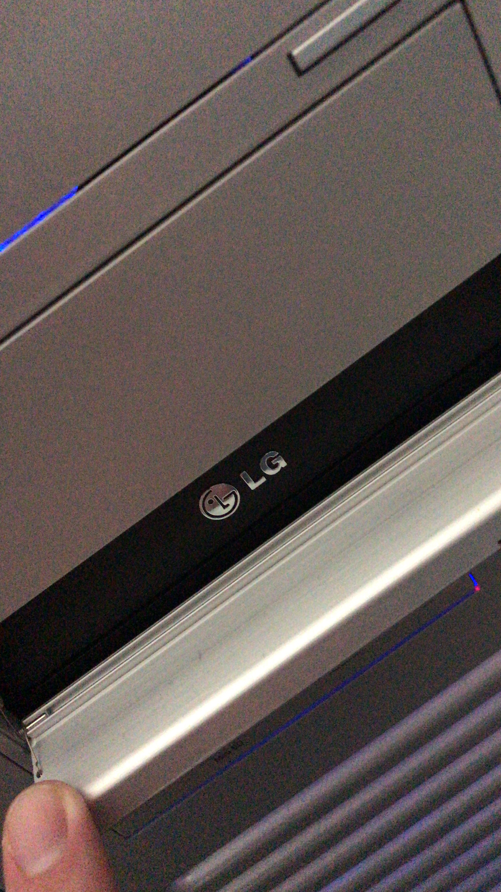

- I am very impressed with [Velocity Micro](https://velocitymicro.com/), the system used quality parts and was well put together, good cable management, nothing was loose or rattling around even after this used system was shipped across the country.
  
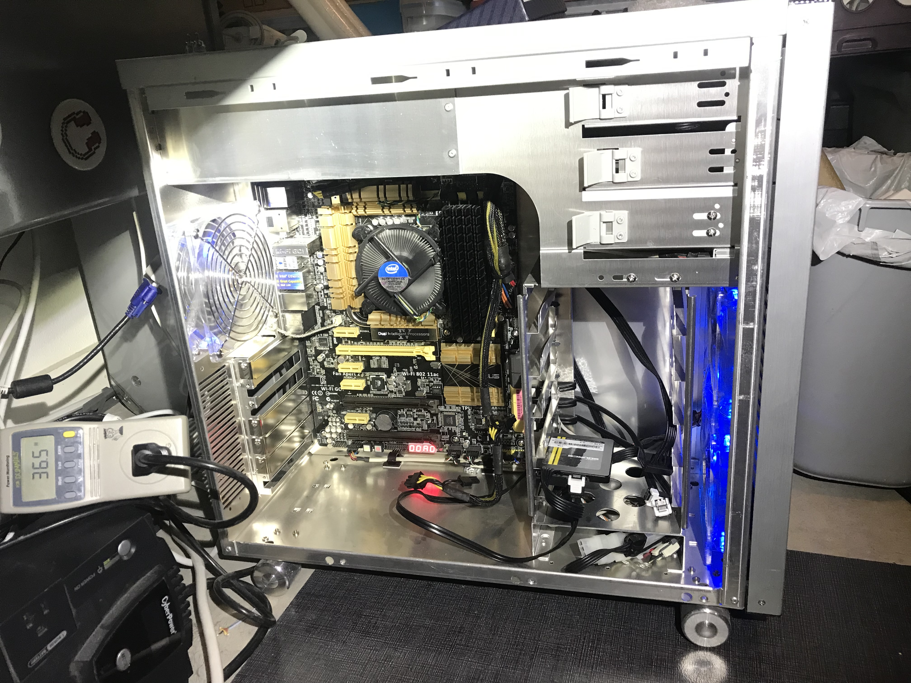

## Fixes needed to get started using this as my primary system

### No Hard drive mounting brackets / screws

As it was received I was a bit short on a few things, no GPU, but it does have integrated GPU, so that was enough to get the thing running . The other  issues was hard drives, this cases requires something special to mount the 3.5" disk drives, it did not have the needed parts. I need to be able to move over the four drives from the Mac Pro and not have then laying loose in the case. Luckily this was a Velocity Miro build, and I was able to contact support, and they mailed me out an extra parts bag for like $20

   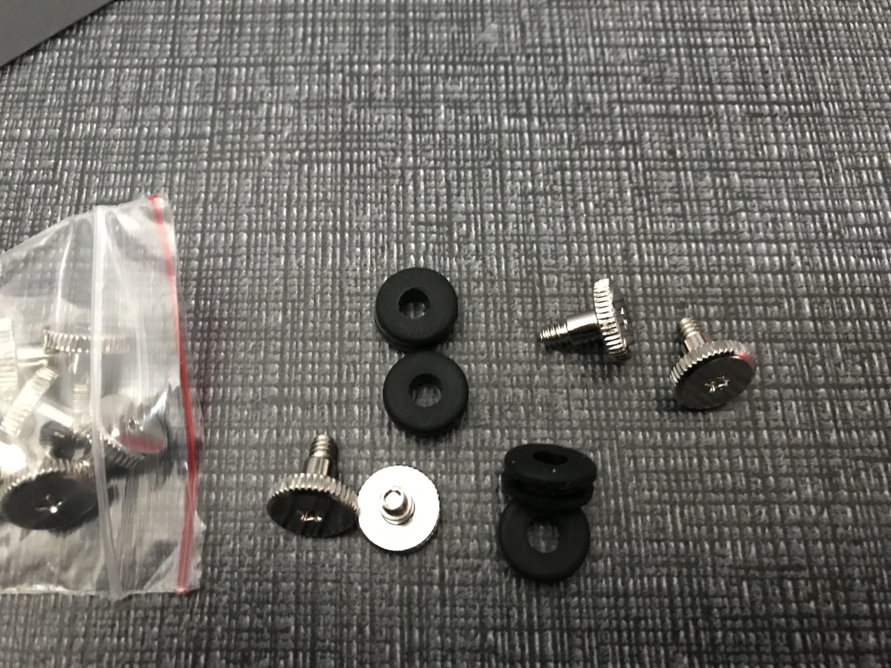
   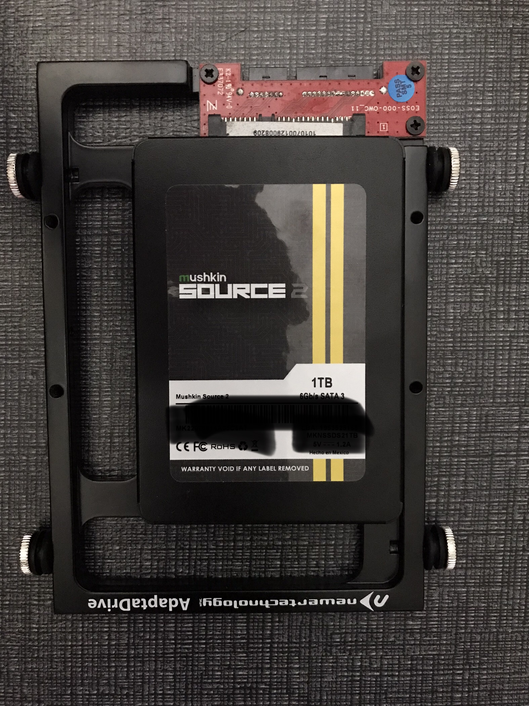
   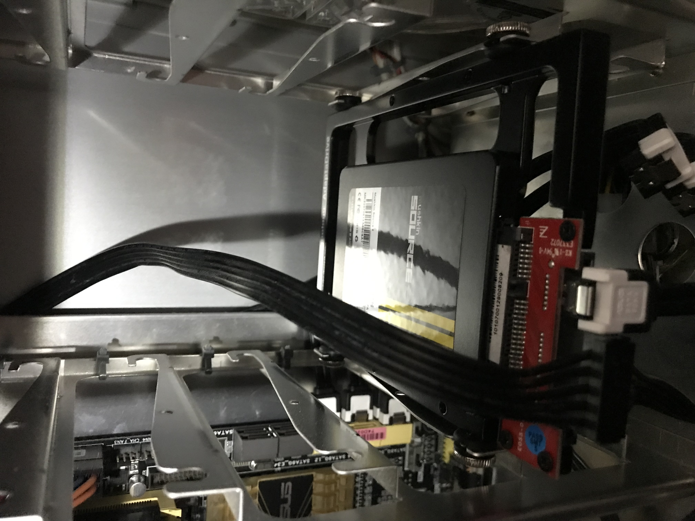

### No GPU
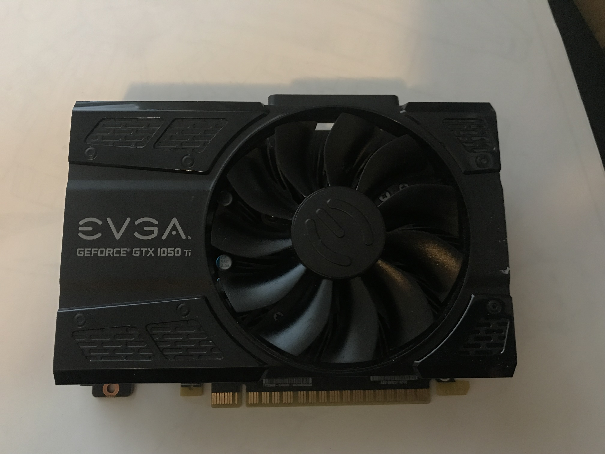
The GPU part I solved with Facebook marketplace, I found a whole computer with an Evga Nvidia GTX 1050 Ti GPU for $100, which at the time was what the GPU itself was worth. So I picked it up and some more problems with it, another case although this one was a missing side door and GPU with a missing L mounting bracket to fully secure it in the case. But all things considered I received another whole working computer for only $100 so it was another good deal.

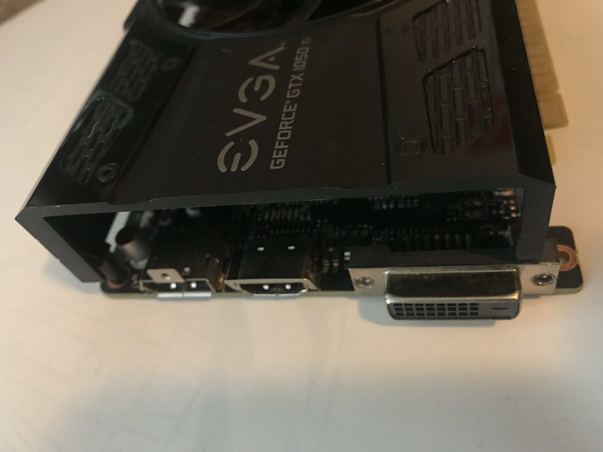

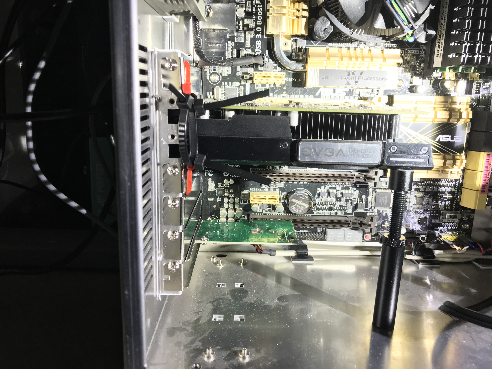

### The original Lian Li Blue LED fans needed to be replaced 

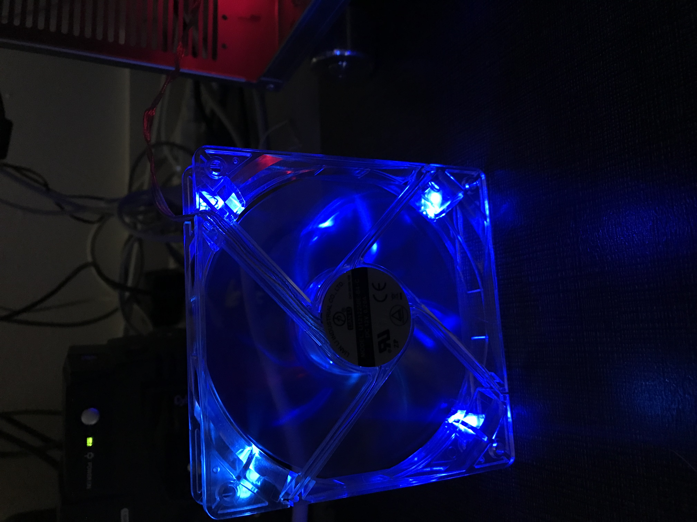

<video controls width="50%">
  <source src="LianLiOriginalFanNoise.webm" type="video/webm" />

  Playback is not working download 
  <a href="LianLiOriginalFanNoise.webm">Lian Li fan noise video in WEBM format</a>
  video.
</video>

The case fans had to go, they were the original Lian Li that came with case.  In fact, they were so old that they did not even support PWM like the motherboard in the system did. I am guessing this system was upgraded by Velocity Micro to the Z-87 board as part of system refresh / update, something you can do at any time with your old system send it back to Velocity Micro to have them upgraded for you, very nice. Anyway the fans had a lot of bearing noise a sound similar to crickets chirping but at a lower pitch. I found three [Noctua NF-P12 Redux-1700 rpm PWM 120 mm  fans](https://noctua.at/en/nf-p12-redux-1700-pwm) used on eBay. I bought the quiet server fans, which replaced the chirping with the quiet roar of airflow. At some point I may try to find something more quiet but for now these work well enough, I would like a little more quiet, like the Mac Pro is sans its Linux GPU driver trouble noise which on its on rivals and exceeds the entire array of all the fans in Velocity Micro system combined in terms of level of annoyance.

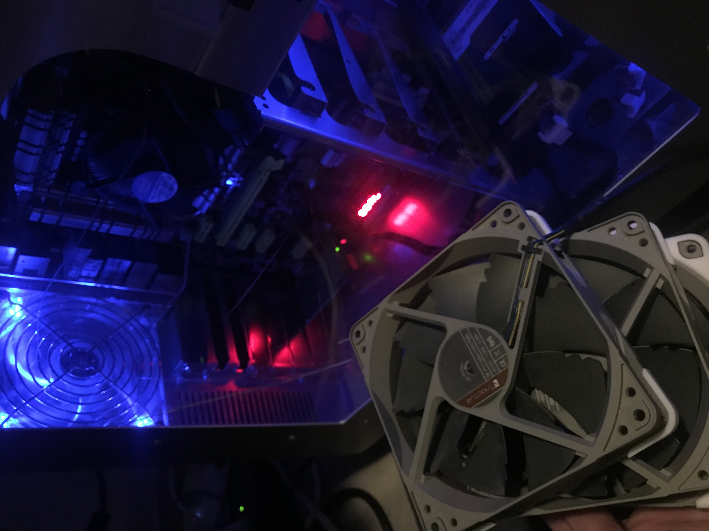

<video controls width="250">
  <source src="Noctua.webm" type="video/webm" />

Playback is not working download the
  <a href="Noctua.webm">Noctua fan sound video in WEBM format</a>
  video.
</video>

## Other changes made after using the system for almost a year

- removed the blue Logo back lighting board
- Put masking tape over the blue HDD activity LED, it was too bright and annoying.
- Added intake filter mesh to the front of the case.

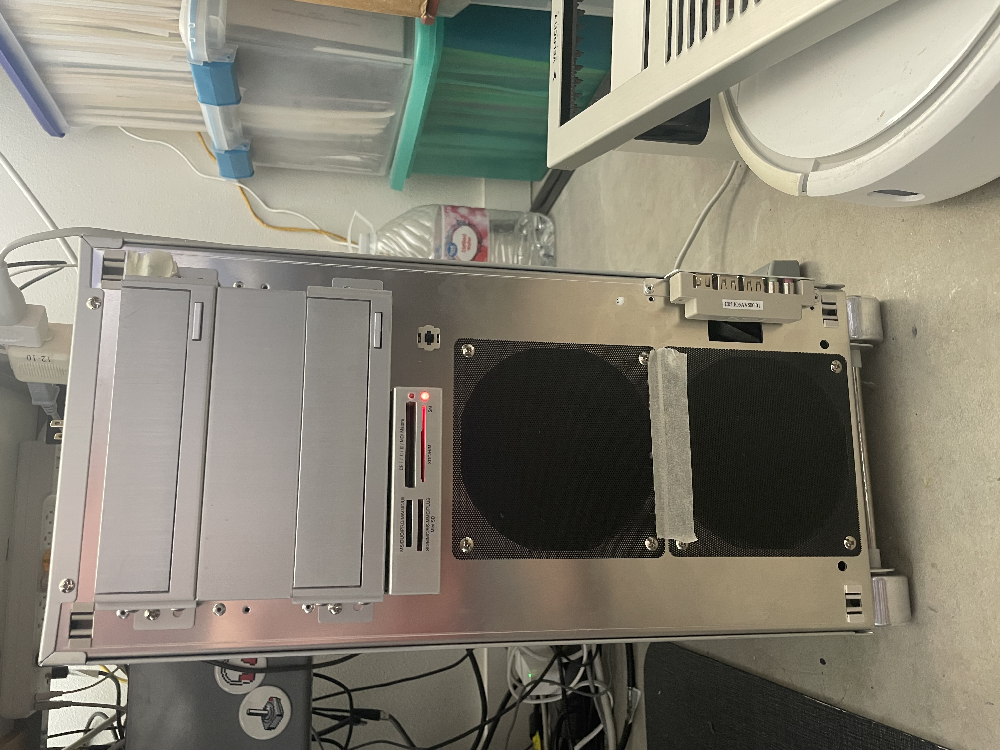

Lastly I had to remove the front logo LED board. It was just too blue  and bright especially at night, I know the blue LED was a marvelous innovation of the 2000s era, but I have never been a fan, I still prefer the green LED everywhere over the blue ones.

## Future changes

- Upgrade the CPU cooler , since the stock intel one can sound a bit like a steam train whistle off far in the distance. Would like to try to fit in a [Noctua NH-D14 CPU cooler](https://noctua.at/en/nh-d14). Want to try to get to a system that does not change its noise level based on the CPU load, I want it to be quiet all the time.

- Try some quieter fans like the [Noctua NF-S12B redux-1200 PWM](https://noctua.at/en/nf-s12b-redux-1200-pwm) or the [Noctua NF-S12A PWM](https://noctua.at/en/products/fan/nf-s12a-pwm)

- Add single  a ARGB Fan to the lower 120MM intake to add some custom LED lighting effects to show the CPU Load, but have it be off or extremely dim when the system is during overnight hours. 

- TRy adding a sata raid for boot and home partition to try and get closer to 2x performance.

- Try the hack to be able to add in PCIE Nvme to a Z87.

- Upgrade to a newer Motherboard, a NVME upgrade would be a huge improvement since my current workflows if trying to do too much at once easily swamps the I/O of the sata SSDs I have.

- Upgrade the GPU when I really need a faster one.

- Replace the cracked clear Acrylic side door panel.

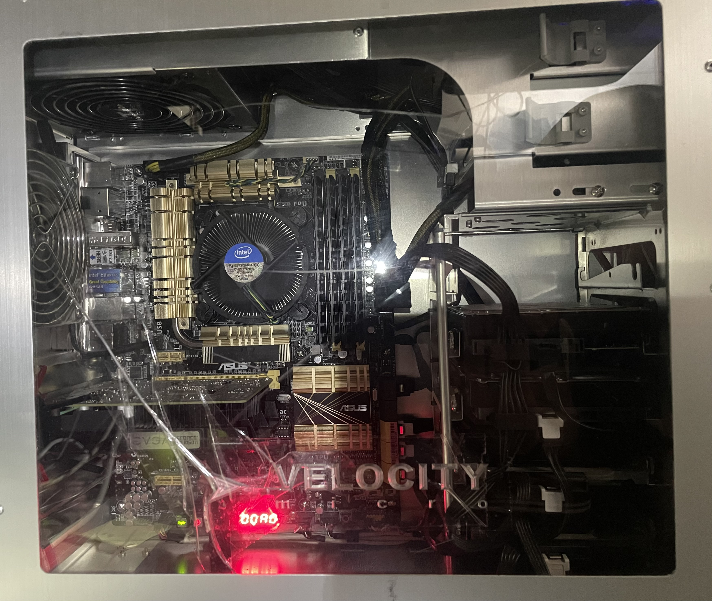

## Conclusion

I am exceedingly happy with this system and the system builder [Velocity Micro](https://www.velocitymicro.com), it has been a great upgrade over the Mac Pro 3,1. and I am happy to have found this system which is exactly what I needed at the right time, and look forward to making changes and customizing this classic style system for years to come.