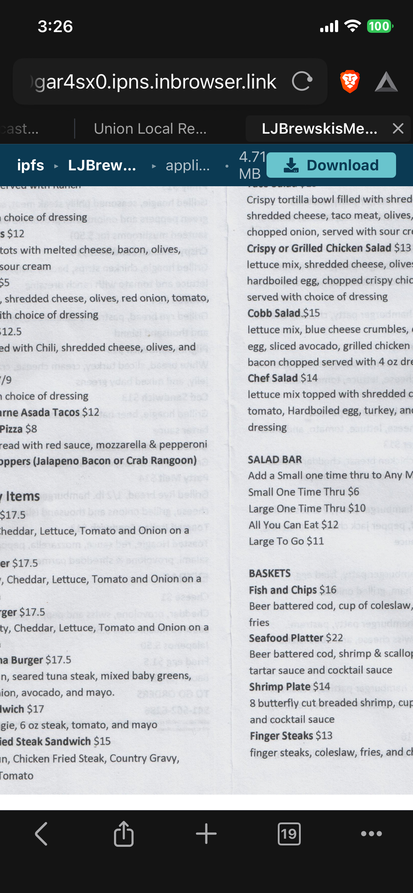

## The backstory

Recently, I have been building [Un-Official free websites]() for local business 
and resources. Part of the process I have 
implemented includes adding relevant copies of necessary resources in various formats for better accessibility: A 
[PDF](https://en.wikipedia.org/wiki/PDF) and corresponding plain text 
[HTML](https://en.wikipedia.org/wiki/HTML) version of menus. I host these free un official pages using 
[IPFS](https://en.wikipedia.org/wiki/InterPlanetary_File_System).
Recently on mobile IPFS implemented an In browser IPFS JavaScript client. Part of the endpoint process introduced a 
differnt way to 
download a PDF, rather than handle it as It's implemented just file download for the PDF.
The new in browser adds a new view with a header with download button and then shows an embeded-pdf view of the file 
intended to be downloaded. This re introduces the problem I had orginally fixed, by not using an embeded PDF on the 
page. Mobile display of PDF especially on iPhone / iPad is particually bad, just shows one-page preview. This caused a 
real problem since before on iOS when it recieved the file download it whould just show the PDF in the browser and would 
show all pages. Now it just shows the preview and now the user is unknowingly forced to have to download the PDF to get 
the full picuture. This I found un acceptable and looked for another solution.



## The problem: embedded PDF viewers aren't always reliable on mobile

However, in practice, the embedded PDF viewers aren't always reliable. Mobile embedded PDF viewers are a
patchwork: some browsers render inline, some kick out to a native app, some
silently fail to load a plugin at all, and the experience differs across
iOS, Android, and whatever WebView flavor a given app happens to ship.  For
something as simple as quickly browsing a multipage menu or catalog, that's enough
fragility and frustration that PDF can't be the *only* visual way to view a document. So I had to find something else.

## The first pass: getting the PDF to be in HTML format and how to quickly and easily do that 

Before any of this was scripted, the visual catalog format itself came from
just trying something. That was open the PDF in LibreOffice Draw and then see if I could save it as HTML. It was 
possible exporting a PDF document to HTML through OpenOffice/
LibreOffice's own export dialog, page by page, and using that output as-is.
It worked, and it proved the format was worth having — but it was a manual,
click-through-the-wizard process every time, with no control over the output
folder name, no way to inject a shared stylesheet, and no way to customize
page titles beyond whatever the wizard defaulted to. Fine for a one-off, not
something you'd want to repeat.

## The idea: keep PDF, add a visual image based plain HTML option alongside it

To be clear, this isn't about dropping PDF — PDF stays exactly where it is,
and it's still the right choice for a lot of cases. The goal was to give it
company: a second, simpler format that can be offered as an alternative when
the embedded viewer doesn't cooperate. So alongside the PDF, each document
can now also be exported as a set of plain HTML pages with rasterized
images, the same way LibreOffice's Impress/Draw HTML export wizard does it.

As a fallback or alternative to the PDF, that gives you:

- An overview page with a table of contents and thumbnails
- One HTML page per document page, with simple Back / Continue / First /
  Last navigation
- Just `` tags — no plugin, no viewer, no PDF.js, nothing that can fail
  to initialize on a flaky mobile connection

It's a deliberately "boring" format, and that's the point. It works the same
everywhere a browser works, which is a useful property to have in reserve
when you're serving content to an unpredictable mix of devices —
without giving up the PDF for the cases where it's the better fit, for example on Desktop. 


## This was a case for automating it with AI assistance.

That's where AI assistance came in — not to invent the format, but to turn
the manual export into a proper one-command tool. The ask was straightforward:
take what the OpenOffice wizard produces by hand and reproduce it
programmatically, end to end, with the missing controls (folder naming,
shared CSS, custom titles) added on top. The AI handled the implementation
and testing: rendering `.odg` pages to PDF, rasterizing each page with
poppler, generating letterboxed thumbnails, and templating out the HTML to
match the original wizard's structure — down to matching how the first/last
page nav links go from clickable to plain text.

## Now we have a one-command tool to use visual-catalog-generator

Check out the source code here [visual-catalog-generator - GitHub](https://github.com/djbrieck/visual-catalog-generator)

The result is `odg_to_catalog.py` — what used to be a manual trip through
the OpenOffice export wizard is now a single command. Point it at a `.odg`
file, and it produces a folder like `SampleMenuVisualCatalog/` containing the
overview page, per-page HTML, full-size images, and thumbnails, ready to be
pinned and served over IPFS, and perfect for adding to 
[Un-Offical website template sites](https://github.com/djbrieck/Un-official-static-website-generator) to showcase 
menus, etc.

A few things it lets you control that the manual export never did:

```bash
python3 odg_to_catalog.py SampleMenu.odg \
    --title "Sample Page Menu" \
    --css style.css --css-file mystyles.css
```

- **Output folder name** — defaults to `<basename>VisualCatalog`, or set
  your own with `--out-dir`
- **Shared CSS** — every generated page links the same relative stylesheet,
  so a whole set of catalogs can share one theme
- **Custom titles** — the overview page gets your base title as-is
  (`Sample Page Menu`), and every sub-page gets it numbered
  (`Sample Page Menu - 1`, `Sample Page Menu - 2`, `Sample Page Menu - 3`, ...)

Under the hood it's just LibreOffice headless for the `.odg` → PDF step,
`pdftoppm` to rasterize pages, and Pillow to build the thumbnails and
letterbox them into a consistent 256×192 box — the same footprint as the
original export's thumbnails, so it drops into existing layouts without
surprises.

It's a small tool, but it adds something valuable alongside the PDF: a
second format that's boring in the best way — plain HTML and PNGs that any
browser, on any platform, can render without a plugin. PDF stays as an
option for anyone who wants it; the visual catalog is there for the cases
where the embedded viewer isn't cooperating.
