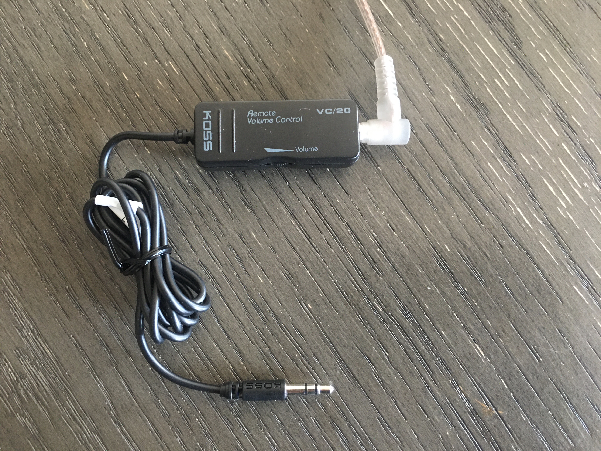

## The Problem

Are you running into a problem where you are trying to play some audio via headphones while attached to some kind phone or computer but finding that when 
 your setting the volume at its lowest level your audio being played back is still too loud in your headphones? And when you try lowering the volume  more via the computer / software volume control then there is no sound at all.

## The Fix

Now for the fix, this will require a small hardware purchase to fix. The solution is adding an analog 3.5" inline volume control before your wired headphones.

The one I found is the KOSS VC 20, I found it new on eBay and was able to purchase including delivery for less than $15 USD. 

Simply plug in the KOSS VC20  (analog inline volume control) between your headphones and the device playing the audio.

Here is what I do adjust the volume.  First I adjust software volume level on the phone or computer to the 25% - 50% power range. Then use the volume wheel on the VC 20 to get the sound level where I want it. 