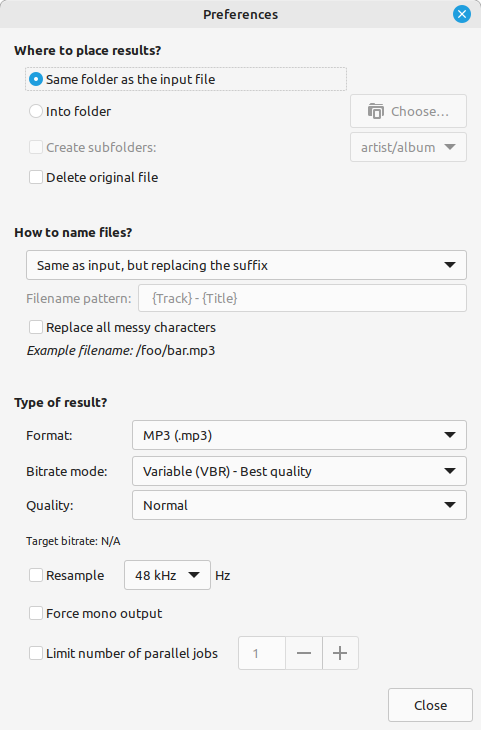

So I have a few giant WAV files that I need to convert to something more reasonable in file size. 1HR audio track weighs in at nearly 500MB, yikes! 

Could not figure out how to do it.  Searched and Found this article [Easily Convert Audio File Formats on Linux](https://itsfoss.com/sound-converter-linux/)  and discovered
the program [Sound Converter](https://soundconverter.org/), which is like [HandBrake](https://handbrake.fr/) for audio files, exactly what I was looking for.

1.  Open [Software Manager](https://github.com/linuxmint/mintinstall).
2. Search for `sound converter` and install [Sound Converter](https://soundconverter.org/)
3. Open Sound Converter
4. Add the files or folder to the program by clicking the respective icons

5. Click Settings gear and set the Type of result? MP3, OGG, M4A, etc.  you want output and then click Close when you have the setting as you like

6. Then click the "Convert" button and wait for the conversion to complete.
