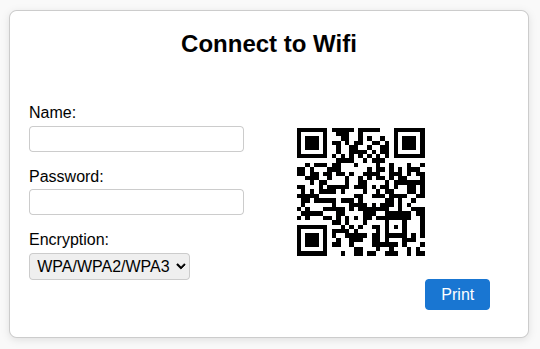

## Introduction 

Ever since [discovering I could create a QR code for easily connecting to Wi-Fi networks]() I have been making QR codes using [QtQR](https://launchpad.net/qr-tools) and importing those into a [LibreOffice document](https://www.libreoffice.org/) for printing, sharing and saving.  Then more recently  I started promoting this blog's [local resource lists]()  using a QR code on a 3x5 index card which is turing out to be a great format for printing and sharing locally.

## The Idea

Then I had the idea why not make a 3 X 5 size card form that is the page so you could fill in the information and then just Print it right from the web page. And avoid a lot of the manual work of generating documents and QR codes separately.

## The Solution

I shared that with [Microsoft Copilot,](https://copilot.microsoft.com/) and it helped me come up with the following solution in seconds. I needed to make a few minor formatting changes and correct one mistake where it was passing a string of `None` instead of `` for the None encryption option, but otherwise pretty much as is solution.  



## Live Example 

Now of course using [IPFS](https://ipfs.tech/) I was able to pin it and make it available as [Wi-Fi Sharing card](https://bafybeigdx64fuiijt75z52xjemnpedy5mkkf45mm372ldqec42trmek5am.ipfs.dweb.link/). Feel free to use and print these for your wireless connecting chores, these will be super handy to have on hand for family, friends, and guests.

## The HTML Source Code

```
<!DOCTYPE html>
<html lang="en">
<head>
    <meta charset="UTF-8">
    <meta name="viewport" content="width=5in, initial-scale=1.0">
    <title>Wifi QR Code Sharing Card Generator</title>
    <style>
        @media print {
            @page {
                size: 5in 3in landscape;
                margin: 0;
            }
            body {
                width: 5in;
                height: 3in;
                margin: 0;
                padding: 0;
            }
            .container {
                box-sizing: border-box;
                width: 5in;
                height: 3in;
                border: none !important; /* Hide border when printing */
                margin: 0;
                padding: 0.2in;
                display: flex;
            }
            .form-section, .qr-section {
                background: none;
                box-shadow: none;
            }
            .form-section {
                display: none;
            }
            .qr-section {
                flex: 1;
                display: flex;
                flex-direction: column;
                align-items: center;
                justify-content: center; /* Center vertically when printing */
                position: relative;
                height: 100%;
            }
            .print-btn {
                display: none;
            }
            .hide-print {
                display: none !important;
            }
            body {
                margin: 0 !important;
                padding: 0 !important;
            }
            .container {
                margin: 0 !important;
            }
            .card-title h2 {
                margin-top: 0 !important;
            }
        }
        body {
            font-family: Arial, sans-serif;
            background: #f9f9f9;
        }
        .container {
            width: 5in;
            height: 3in;
            margin: 2em auto;
            background: #fff;
            border: 1px solid #ccc;
            border-radius: 8px;
            display: flex;
            box-shadow: 0 2px 8px rgba(0,0,0,0.1);
            padding: 0.2in;
            flex-direction: column;
            position: relative;
        }
        .card-title {
            width: 100%;
            text-align: center;
            margin-bottom: 0.5em;
        }
        .form-section {
            flex: 1;
            margin-right: 0.2in;
            display: flex;
            flex-direction: column;
            justify-content: center; /* Center vertically */
            align-items: flex-start; /* Keep left alignment */
            height: 100%; /* Ensure it uses full height for centering */
        }
        .form-section label {
            margin-top: 0.5em;
            font-size: 1em;
        }
        .form-section input, .form-section select {
            margin-top: 0.2em;
            margin-bottom: 0.5em;
            font-size: 1em;
            padding: 0.2em;
            border-radius: 4px;
            border: 1px solid #ccc;
        }
        .print-btn {
            margin-top: auto; /* Push button to bottom */
            margin-bottom: 0.5em;
            align-self: center;
            padding: 0.4em 1em;
            font-size: 1em;
            border: none;
            border-radius: 4px;
            background: #1976d2;
            color: #fff;
            cursor: pointer;
        }
        .qr-section {
            flex: 1;
            display: flex;
            flex-direction: inherit; /* Stack QR and button vertically */
            align-items: center;
            justify-content: center;
            position: relative;
        }
    </style>
    <!-- QRCode.js CDN -->
    <script src="https://cdnjs.cloudflare.com/ajax/libs/qrcodejs/1.0.0/qrcode.min.js"></script>
</head>
<body>
    <div class="container">
        <div class="card-title" style="width: 100%; text-align: center; margin-bottom: 0.5em;">
            <h2 style="margin: 0;">Connect to Wifi</h2>
        </div>
        <div style="display: flex; flex: 1; width: 100%; height: 100%;">
            <div class="form-section">
                <label for="ssid">Name:</label>
                <input type="text" id="ssid" autocomplete="off">

                <label for="password">Password:</label>
                <input type="text" id="password" autocomplete="off">

                <label for="encryption" class="hide-print">Encryption:</label>
                <select id="encryption" class="hide-print">
                    <option value="WPA">WPA/WPA2/WPA3</option>
                    <option value="WEP">WEP</option>
                    <option value="">None</option>
                </select>
            </div>
            <div class="qr-section">
                <div id="qrcode"></div>
                <button class="print-btn" onclick="window.print()">Print</button>
            </div>
        </div>
    </div>
    <script>
        function generateWifiQR() {
            const ssid = document.getElementById('ssid').value;
            const password = document.getElementById('password').value;
            const encryption = document.getElementById('encryption').value;
            let qrData = `WIFI:T:${encryption};S:${ssid};P:${password};;`;
            // Remove previous QR code
            document.getElementById('qrcode').innerHTML = "";
            new QRCode(document.getElementById('qrcode'), {
                text: qrData,
                width: 128,
                height: 128,
                correctLevel: QRCode.CorrectLevel.H
            });
        }

        document.getElementById('ssid').addEventListener('input', generateWifiQR);
        document.getElementById('password').addEventListener('input', generateWifiQR);
        document.getElementById('encryption').addEventListener('change', generateWifiQR);

        // Initial QR code generation
        generateWifiQR();
    </script>
</body>
</html>
```
