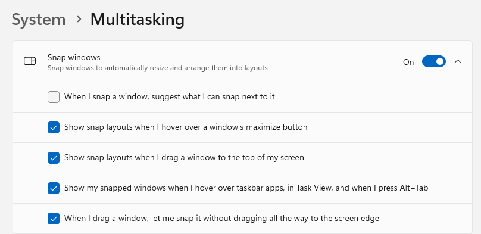

Trying to stop the next window to resize and position suggestion on Windows 10,11. This is when you snap a window and
then Windows hijacks the UI  asking you now what other windows you would like to fill out the other half the screen 
with. If you're not a fan of that like me, the good news is this is easy to fix. 

## Turn off show what I can snap next to the window just snapped
### Windows 11
1. Open Start Menu search for "snap".
2. Select `Snap window settings`
3. On the Snap Window panel to the right of the On Toggle click the downward pointing Arrow to expand.
4.  Uncheck `When I snap a window, suggest what I can snap next to it`

### Windows 10
1. Open Start Menu search for "snap".

2. Select "Snap Settings"

3. Uncheck "When I snap a window, show what I can snap next to it" 
